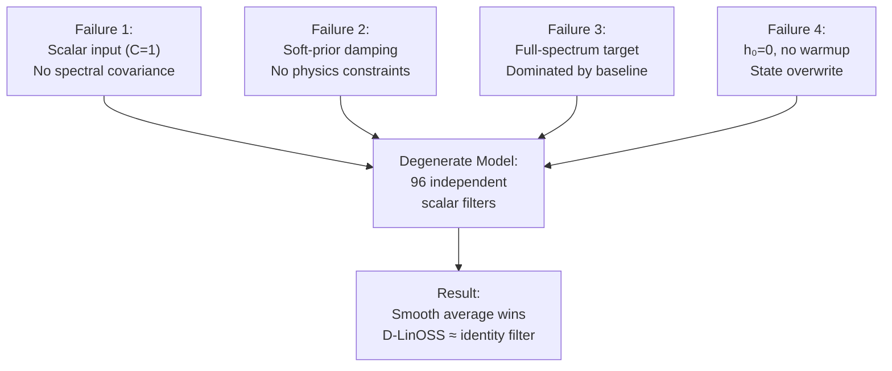

# TRAPPIST-1e D-LinOSS v0 — Failure Assessment

**Date:** 2026-06-19  
**Scope:** Full audit of `aq_trappist1e_dlinoss_stellar_state_residual_0`  
**Source Documents:** README, closeout memo, all run memos, model source code  

---

## Executive Summary

D-LinOSS v0 was retired after it consistently lost to simple baselines. The later audit identified an upstream problem more fundamental than the four architecture defects: the astronomy experiments were performed on residualized `x1dints` integration flux, while the DREAMS contamination framework operates on wavelength-dependent transit depths extracted from fitted spectrophotometric light curves. The 500 ppm raw-flux failure therefore cannot be interpreted as a Program 1331 transmission-spectrum sensitivity limit.

**The model that was tested was not a properly configured D-LinOSS.** It was a degraded approximation with four compounding architectural errors that prevented it from ever accessing the spectral covariance structure D-LinOSS needs to decompose stellar contamination.

The later equal-supervision rematch materially improved that picture, but it did not reopen the astronomy branch. Once the four implementation failures were corrected, physics-locked residual D-LinOSS showed strong synthetic capacity and slightly outperformed the equal-supervision linear SSM in every arm. It still failed the practical promotion gates because the margin over the linear SSM was too small, mask-conditioned robustness stayed below threshold, and leave-window-out generalization remained weak or negative. The branch closeout therefore changed from "broken implementation" to "model-selection result": the JWST-facing detector path remains the residual-first linear SSM / baseline stack, not D-LinOSS.

---

## What Data We Were Actually Modeling

An astrophysicist reading this branch should interpret it as a time-series contamination-separation study on JWST transit spectroscopy, not as an atmosphere retrieval attempt.

The real-data observables were:

- `Program 1331`: four TRAPPIST-1e NIRSpec/PRISM visits
- integration-time spectra over wavelength for each visit
- uncertainty arrays, valid-data masks, transit phase, and visit timing
- residualized spectra after removing dominant visit-mean or smooth baseline structure

The paired-data observables were:

- `Programs 9256/6456`: three verified close TRAPPIST-1b/e pairs
- matched b/e spectral tensors on a common wavelength grid
- measured b/e time offsets of 4.26, 4.42, and 6.01 hours

The astrophysical structure of interest was:

- wavelength-dependent stellar contamination that changes between visits or between close b/e observations:
  spot/facula color contrast, activity-state drift, flare contamination, phase- or chord-dependent chromatic residuals

The structure we hoped would remain after contamination correction was:

- a stable planetary transmission residual shared across TRAPPIST-1e visits

The branch was designed to reject shortcut signals such as:

- static continuum level
- smooth visit-average shape
- mask pattern or wavelength coverage
- visit identity or pair identity artifacts
- bookkeeping structure unrelated to stellar or planetary physics

## Failure 0: Wrong Pipeline Stage

This failure is upstream of the four model-implementation failures below.

### What DREAMS analyzes

For each of the four Program 1331 visits, the reduction must first produce a visit-level transmission spectrum:

`wavelength, fitted transit depth, depth uncertainty`

That requires two explicit fitting stages:

1. White-light fitting for the visit baseline/systematics, limb darkening, transit center, and common transit geometry.
2. Wavelength-channel light-curve fitting for the transit depth in every spectral bin, using the validated timing and systematics model.

The DREAMS GP then explains visit-to-visit residuals among four `[wavelength, depth, uncertainty]` spectra. Atmospheric retrieval follows only after that contamination model.

### What this branch modeled

The experimental models received integration-level tensors shaped approximately `[visit, integration, wavelength]`. Residualization removed means or smooth trends, but it did not turn raw integration flux into fitted transit depth. The model was therefore asked to infer contamination while simultaneously carrying the dominant stellar continuum, instrumental drift, transit light-curve shape, and adjacent-integration autocorrelation.

### Why the baselines won

Smooth and last-visit baselines are strong on raw flux because neighboring integrations and visit-average spectra are highly correlated. That comparison is not representative of the task DREAMS poses in transmission-depth space, where the common light-curve and continuum structure have already been fitted out.

The injection audit inherited the same mismatch. Ppm-scale residuals were injected and scored in raw-flux residual space rather than propagated through the full light-curve fit into extracted depth space. Its null sensitivity floor is therefore specific to that objective and must not be quoted as an atmospheric or transmission-spectrum limit.

### Correct next real-data sequence

1. Reproduce the Allen/Lewis white-light fits and fitted transit centers.
2. Fit every wavelength-channel light curve with consistent limb darkening, baselines, masks, and uncertainty propagation.
3. Validate four extracted visit spectra against the released DREAMS depth tables.
4. Only then compare per-visit GP, linear SSM, and any future physics-locked D-LinOSS contamination model.

This is a substantial reduction project. It is separate from the completed synthetic architecture capacity test.

---

## Failure 1: Input Shape Collapse — `[4, 209, 96, 1]` with `C=1`

> [!CAUTION]
> This is the single most damaging error. Everything downstream is contaminated by it.

### What happened

The corrected tensor shape was `[V=4, T=209, L=96, C=1]`. In [stellar_state_scan.py](file:///c:/Users/cityz/IllI/newer_all/emergent_quantum_geometries/aq_trappist1e_dlinoss_stellar_state_residual_0/models/stellar_state_scan.py):

```python
input_kernel = jax.random.normal(keys[1], (n_channels, hidden_dim)) / jnp.sqrt(n_channels)
```

With `n_channels = 1`, the input projection is a single scalar → hidden_dim vector. The model sees **one flux value per integration timestep**. The 96-bin spectral axis is treated as a batch dimension via `wavelength_gate`, not as a feature dimension.

### Why it's fatal

D-LinOSS is a state-space model. Its power comes from modeling **cross-wavelength covariance** — how flux at 1.4 µm correlates with flux at 3.3 µm over time, which is exactly what stellar spot/faculae contamination does. With `C=1`, there is no spectral covariance structure in the hidden state. The model degenerates to 96 independent scalar filters running in parallel, each seeing one wavelength's flux time series. A smooth temporal average trivially beats this because the dominant signal in each wavelength's time series is the static spectral level.

### Correct shape

The model should receive `[T=209, features=96]` per visit, where the full spectrum at each timestep is the feature vector. The `input_kernel` should be `(96, hidden_dim)`.

---

## Failure 2: Soft-Prior Damping Bank — Physics Was Never Enforced

### What happened

In [physical_dampers.py](file:///c:/Users/cityz/IllI/newer_all/emergent_quantum_geometries/aq_trappist1e_dlinoss_stellar_state_residual_0/models/physical_dampers.py), the damping bank is a set of Gaussian wavelength gates:

```python
"CH4_3p3um": gaussian_gate(wavelength_um, 3.30, 0.15),
"CO2_4p3um": gaussian_gate(wavelength_um, 4.30, 0.20),
...
```

These gates were used as "soft prior only" — initialization values that the optimizer was free to discard. The self-supervised intravisit memo confirms: **"Damping ablation changed the loss, but not enough to rescue the model gates."**

### Why it matters

In the quantum transport work that succeeded (OAT/D-LinOSS), the Hamiltonian **set** the eigenstructure and the model operated within that constraint. D-LinOSS's imaginary eigenvalues (oscillation frequencies) should be physics:

| Physical Process | Eigenfrequency |
|:---|:---|
| Stellar rotation (TRAPPIST-1) | $\omega_{rot} = 2\pi / (3.3 \text{ days})$ |
| Starspot lifetimes | $\omega_{spot} = 2\pi / (\text{weeks})$ |
| Chromospheric line widths (Hα, Ca II H&K) | $\Gamma = e^2 \omega^2 / 6\pi\epsilon_0 m_e c^3$ |

Only the **real parts** (damping timescales) should be learned. The oscillation frequencies are known from stellar physics. Making them free parameters means the optimizer can (and did) collapse them to trivial values, producing a model indistinguishable from a smooth filter.

### What the damping bank actually was

The "dampers" in `physical_dampers.py` are not even eigenfrequency constraints — they are wavelength-domain Gaussian windows for spectral feature selection. They have no temporal/dynamical content at all. The file is misnamed relative to its function.

---

## Failure 3: Wrong Training Objective — Full-Spectrum Reconstruction

### What happened

From [stellar_state_scan.py](file:///c:/Users/cityz/IllI/newer_all/emergent_quantum_geometries/aq_trappist1e_dlinoss_stellar_state_residual_0/models/stellar_state_scan.py#L96-L100):

```python
prediction = outputs["pred"]
target = x
weights = mask[..., None] / jnp.square(sigma)
recon = jnp.sum(weights * jnp.square(prediction - target)) / denominator
```

The loss minimizes reconstruction error on the **full spectrum** `x`. This means the optimizer learns to predict the dominant static spectral baseline — which a visit-mean or smooth average does nearly perfectly. The injection oracle audit confirmed this: even known-template oracle methods only recovered injected signals at correlation ~0.052 at 500 ppm when evaluated against the full spectrum.

### The fix that partially worked

The residual-first oracle (`PROGRAM1331_RESIDUAL_FIRST_ORACLE_1.md`) demonstrated that baseline-subtracted residuals **do** preserve injected signals (oracle recovery correlation = 1.0 for all nonzero amplitudes). But when D-LinOSS was retrained on residual targets (`PROGRAM1331_RESIDUAL_INJECTION_1.md`), it still lost to the simple residual baseline (D-LinOSS: 0.624 vs baseline: 0.821 at 500 ppm).

### Why residual-first alone wasn't enough

Because Failures 1 and 2 were still active. The model was still seeing scalar inputs and had no hard eigenfrequency constraints. Residual-first preprocessing fixed the target space but not the model's capacity to decompose what it was seeing.

---

## Failure 4: Hidden State Overwrite — No Temporal Memory

### What happened

From [stellar_state_scan.py](file:///c:/Users/cityz/IllI/newer_all/emergent_quantum_geometries/aq_trappist1e_dlinoss_stellar_state_residual_0/models/stellar_state_scan.py#L61-L78):

```python
initial = jnp.zeros((n_wavelengths, hidden_dim), dtype=x.dtype)
...
transported = hidden + transport_scale * (transported_candidate - hidden)
```

With `transport_scale=1.0`, `h_0 = 0`, and strong input drive, every new integration **overwrites** the previous hidden state rather than accumulating a trajectory. The model learns to ignore its own history because:

1. `h_0 = 0` is wrong — the star has state before the first integration
2. With `transport_scale=1.0`, the update is `hidden = transported_candidate` (full replacement)
3. No warmup masking in the original `stellar_state_scan.py` loss

### The partial fix

The visit transport model ([visit_transport_dlinoss.py](file:///c:/Users/cityz/IllI/newer_all/emergent_quantum_geometries/aq_trappist1e_dlinoss_stellar_state_residual_0/models/visit_transport_dlinoss.py#L73-L86)) did add warmup:

```python
warmup_fraction: float = 0.30,
...
loss_weight = (index >= warmup_count).astype(features.dtype)
```

But the visit transport model **still lost** to last-visit baseline (model loss: 0.004790 vs last-visit: 0.000090). This is because even with warmup, Failures 1 and 2 remained active.

---

## The Compounding Effect

These four failures are not independent — they compound multiplicatively:



With scalar input, there is nothing for the eigenfrequencies to decompose. With soft priors, the eigenfrequencies collapse. With full-spectrum targets, the optimizer finds the baseline. With state overwrite, the model has no memory. The result is a model that is mathematically incapable of doing what D-LinOSS is designed to do.

---

## What Was Validated (and Should Be Preserved)

Despite the model failures, the **pipeline infrastructure** is sound:

| Component | Status | Evidence |
|:---|:---|:---|
| TPU/JAX/pmap path | ✅ Validated | All runs completed on v6e-8 |
| Data ABI | ✅ Validated | Tensor shape, timing, phase, masks all correct |
| Residual-first preprocessing (`R_double_residual`) | ✅ Validated | Oracle recovery = 1.0 for all nonzero amplitudes |
| WASP-39b positive control (linear SSM) | ✅ Validated | Recovery correlation 0.990 |
| Injection/evaluation framework | ✅ Validated | Clean false-positive rate, paired-copy response |
| Strict controls (phase/wavelength/visit shuffle) | ✅ Validated | Framework works; model just didn't pass them |
| Anti-claim discipline | ✅ Exemplary | No false atmosphere/methane claims made |

---

## The Four Fixes (Each a Few Lines of Code)

### Fix 1: Reshape to `[T, 96]`
```python
# Before: input_kernel shape (1, hidden_dim)
# After:  input_kernel shape (96, hidden_dim)
input_kernel = jax.random.normal(key, (96, hidden_dim)) / jnp.sqrt(96)
```

### Fix 2: Hard-Freeze Eigenfrequencies
```python
# Imaginary parts of eigenvalues are FROZEN to physical frequencies
omega_fixed = jnp.array([
    2 * jnp.pi / (3.3 * 86400),   # stellar rotation
    2 * jnp.pi / (14 * 86400),     # spot lifetime (~2 weeks)
    2 * jnp.pi / (7 * 86400),      # active region evolution (~1 week)
    # ... chromospheric line widths from atomic physics
])
# Only learn the real parts (damping rates)
gamma_learnable = jax.nn.softplus(params.log_gamma)
eigenvalues = -gamma_learnable + 1j * omega_fixed  # imaginary part is NOT a parameter
```

### Fix 3: Residual-First Input
```python
# Remove visit mean and smooth trend BEFORE the model sees anything
x_residual = x - visit_mean - smooth_trend
# Model trains on dynamics of deviations, not absolute spectral level
```

### Fix 4: Warmup Masking
```python
warmup_count = int(0.30 * T)  # first 30% builds h_0
loss_mask = jnp.arange(T) >= warmup_count
loss = jnp.sum(loss_mask[:, None] * jnp.square(pred - target)) / jnp.sum(loss_mask)
```

---

## The Honest Question

> Can a correctly-built D-LinOSS separate structured stellar dynamics from unstructured noise with only 4 visits (V=4, T=209)?

That is **not guaranteed**. Four visits may not contain enough temporal leverage to distinguish rotation-modulated contamination from random noise. But it is **genuinely untested**, because what was tested was not D-LinOSS — it was a degraded scalar-input, soft-prior, full-spectrum, memoryless approximation of it.

The linear SSM baseline achieved 0.990 on the WASP-39b injected positive control. A correctly built D-LinOSS should be compared with that baseline under equal supervision in synthetic data, and with GP/SSM baselines only after the relevant astronomical observable has been extracted. Losing on raw Program 1331 integration flux cannot establish that the four visit-level transmission spectra lack decomposable contamination structure.

---

## V1 Rematch Addendum

`AQ-DLINOSS-PHYSICS-LOCKED-RESIDUAL-SMOKE-0` passed all 14 implementation assertions. The corrected model uses `[T, 96]` full-spectrum residual input, fixed external temporal frequencies, learned real damping, 30% warmup masking, constrained incremental assimilation, and persistent hidden state. The original four implementation failures are therefore corrected in v1.

The subsequent local run, `AQ-DLINOSS-PHYSICS-LOCKED-SYNTHETIC-1`, returned:

- physics-locked D-LinOSS residual correlation: 0.322
- probed latent correlation: 0.467
- linear SSM residual correlation: 0.803
- verdict: `PROMOTE LINEAR_SSM_BASELINE_ONLY`

### Frequency interpretation

The rematch used `generate_dlinoss_masked_assimilation.py`, not `make_fake_trappist_shard.py`. Its fixed frequencies were extracted from the synthetic transition eigenangles under the explicit convention that one simulator step equals one day. They therefore match the synthetic generator's discrete modes, although they are intentionally different from the 3.3-day, 7-day, 14-day, visit-separation, and transit-chord frequencies used by the real-data implementation smoke.

### Supervision asymmetry

The numerical gap is not a pure architecture comparison. The linear SSM fitted its transition and observation maps with direct access to the true latent state `z`, including a supervised `z -> residual` decoder. Physics-locked D-LinOSS trained self-supervised on residual prediction; its latent state was evaluated only afterward using a held-out linear probe.

Accordingly, the rematch supports this narrower conclusion:

> Under the tested operational training regimes, the supervised linear SSM is the stronger detector. The run does not establish that a correctly implemented physics-locked D-LinOSS has lower intrinsic representational capacity.

A conclusive capacity comparison requires equal supervision and a bounded optimization sweep. The specification is recorded in `AQ_DLINOSS_EQUAL_SUPERVISION_CAPACITY_TEST_0.md`. This addendum does not reopen the astronomy branch or authorize TPU/JWST runs.

---

## Equal-Supervision Capacity Test Addendum

`AQ-DLINOSS-EQUAL-SUPERVISION-CAPACITY-TEST-0` is the fair rematch that the earlier v1 run did not provide. Both D-LinOSS and the linear SSM received the same train/test splits, the same targets, and the same supervision modes. D-LinOSS was evaluated in two frequency conditions:

- `oracle_frequency`: fixed imaginary poles matched to the synthetic generator's known modal frequencies
- `physical_prior`: fixed imaginary poles taken from the precommitted stellar-timescale prior rather than the generator

The run also enforced the information firewall discussed in the spec: timestamp units, `tau_ref`, generator frequencies, and physical-prior frequencies were committed in the manifest before shard generation.

### What passed

- The architecture is no longer degenerate.
- D-LinOSS reached very high synthetic recovery in every arm.
- D-LinOSS beat the equal-supervision linear SSM in mean residual correlation in all four arms.
- The physical-prior arm remained competitive with the oracle arm, so the model is not only succeeding when handed exact generator frequencies.

### What still failed

- The improvement over the equal-supervision linear SSM was only about `1.25%` to `1.36%`, below the required `5%` gate.
- Mask-shuffle degradation stayed below threshold in every arm:
  `0.1654`, `0.1623`, `0.1797`, `0.1845` versus the required `>= 0.20`.
- Leave-window-out generalization failed in every arm, and was strongly negative in both physical-prior arms.
- The final verdict was `DO NOT PROMOTE`, with `astronomy_authorized = false`.

### Key numbers

Equal-supervision linear baselines:

- latent-supervised linear SSM residual correlation: `0.983086`
- residual-self-supervised linear SSM residual correlation: `0.983075`

Best D-LinOSS arm summaries:

- `oracle_frequency / latent_supervised`
  residual corr `0.996444`, latent corr `0.995959`, mask shuffle `0.1654`, leave-window-out `0.6238`
- `oracle_frequency / residual_self_supervised`
  residual corr `0.996401`, latent corr `0.995946`, mask shuffle `0.1623`, leave-window-out `0.4778`
- `physical_prior / latent_supervised`
  residual corr `0.995334`, latent corr `0.995180`, mask shuffle `0.1797`, leave-window-out `-0.3927`
- `physical_prior / residual_self_supervised`
  residual corr `0.996148`, latent corr `0.995984`, mask shuffle `0.1845`, leave-window-out `-0.6942`

### Interpretation

This is the cleanest result in the branch. It narrows the conclusion to something much more precise:

> Physics-locked residual D-LinOSS has real synthetic representational capacity and modest robustness to imperfect frequency priors, but it does not deliver enough practical advantage over a simpler linear SSM to justify returning it to JWST detector duty.

That is why the branch closeout stands. The issue is no longer that D-LinOSS was implemented incorrectly. The issue is that after correcting the implementation and equalizing supervision, the architecture still did not earn enough margin, mask dependence, or out-of-window robustness to displace the simpler promoted detector path.

### Branch-status update

The branch should now be read in three phases:

1. `v0 failure`
   broken implementation with four compounding architectural errors
2. `v1 repair`
   implementation fixed, but the first synthetic rematch remained supervision-asymmetric
3. `equal-supervision rematch`
   fair capacity test passed as an engineering audit, but failed as a practical promotion test

The authoritative closeout remains:

- D-LinOSS-v0 is retired from the exoplanet residual detector role.
- The residual-first linear SSM / baseline path remains the promoted detector stack.
- No new TRAPPIST-1e or WASP-39b D-LinOSS run is authorized from this branch.

### DREAMS branch handoff

The JWST-facing detector closeout should not be read as a block on the CPU-first DREAMS reproduction branch. That branch has now reached its own closeout state:

- Program 1331 DREAMS GP reproduction: directionally passed
- Paired public b/e data: unlocked with three clean pairs
- Naive b-proxy subtraction: failed and worsened scatter
- `b-proxy + residual GP`: improved in-sample scatter but failed held-out pair prediction and null gates
- Pair-count and strong-prior TPU audits: current public pairs are cadence-limited

This means the paired-data question is no longer "can a more flexible model rescue these three pairs?" The branch answer is now:

> Not on the current public cadence. At the observed 4.26, 4.42, and 6.01 hour offsets, only coarse scalar coupling is robustly identifiable; wavelength-dependent stellar-transfer models do not generalize.

The current handoff is therefore:

- active real-data interpretation path: DREAMS-style e-only per-visit GP
- paired correction closeout: `PROMOTE_GP_ONLY`
- observing-design closeout: `PROMOTE_CLOSER_PAIRING_REQUIRED`

That preserves the detector closeout, preserves the GP reproduction result, and makes the paired-data boundary explicit without reopening the D-LinOSS branch.
