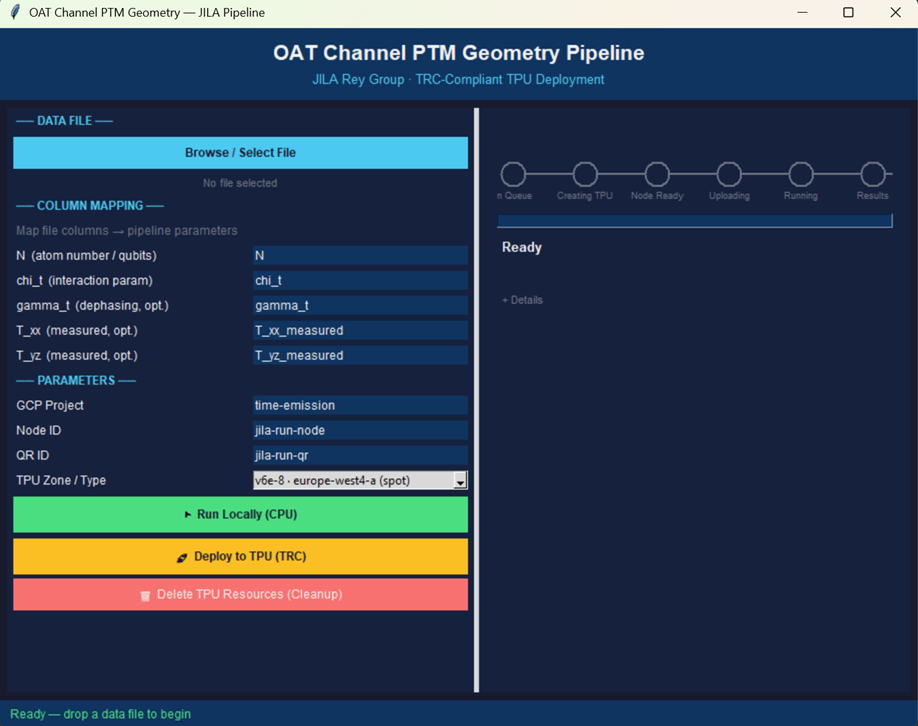
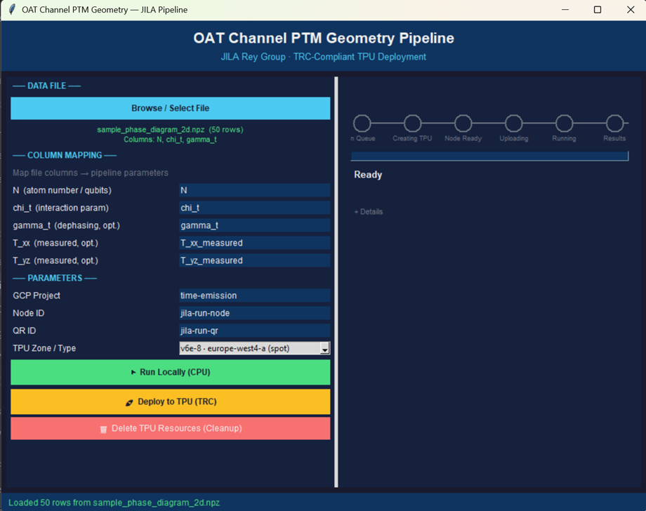
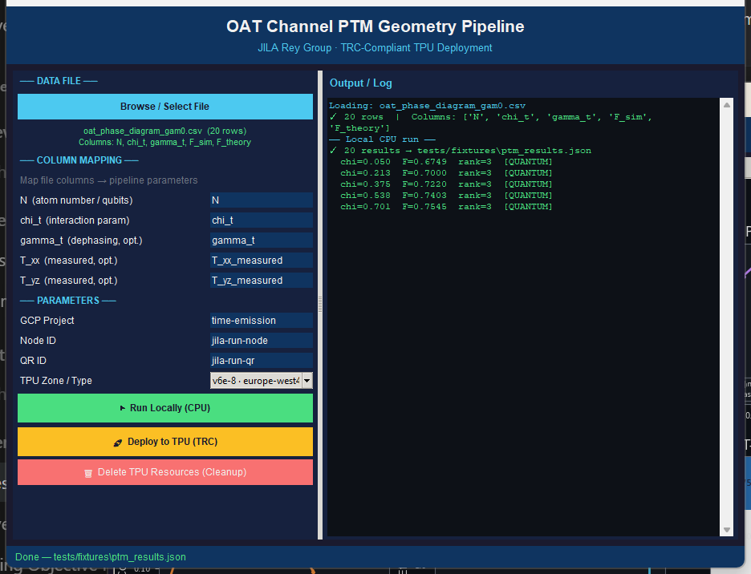
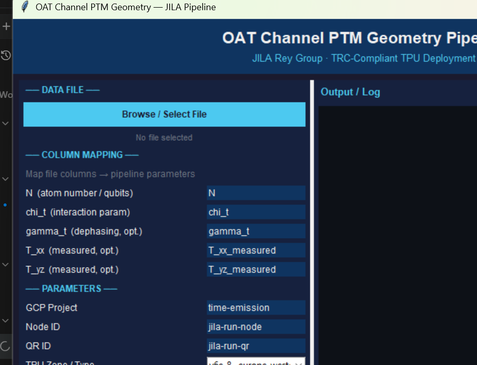
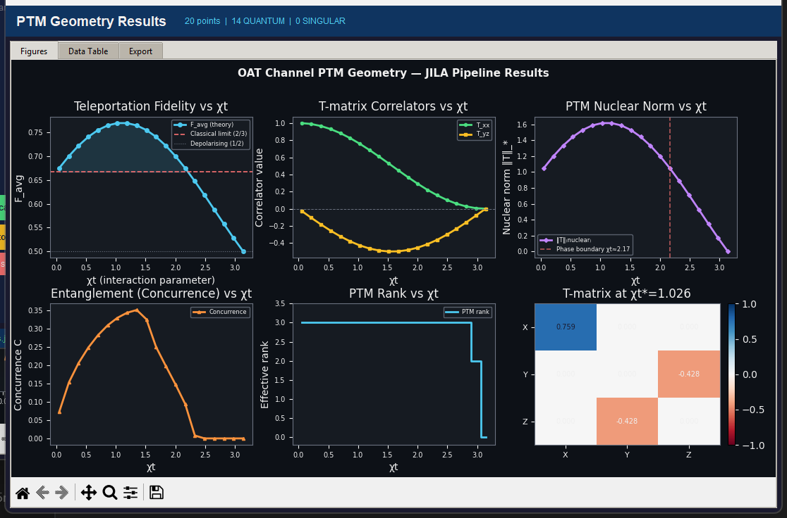
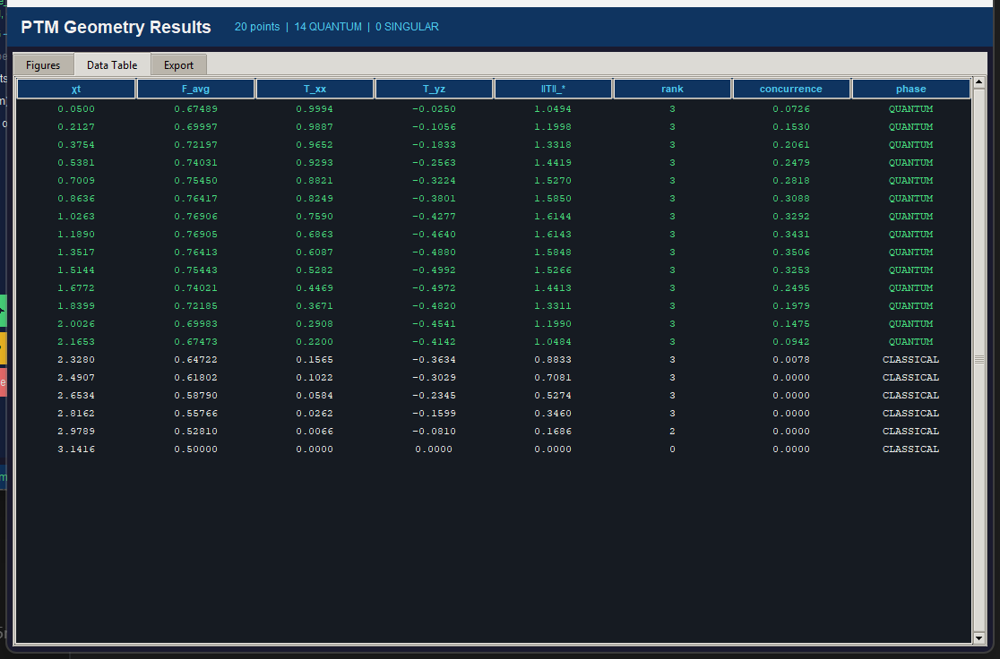
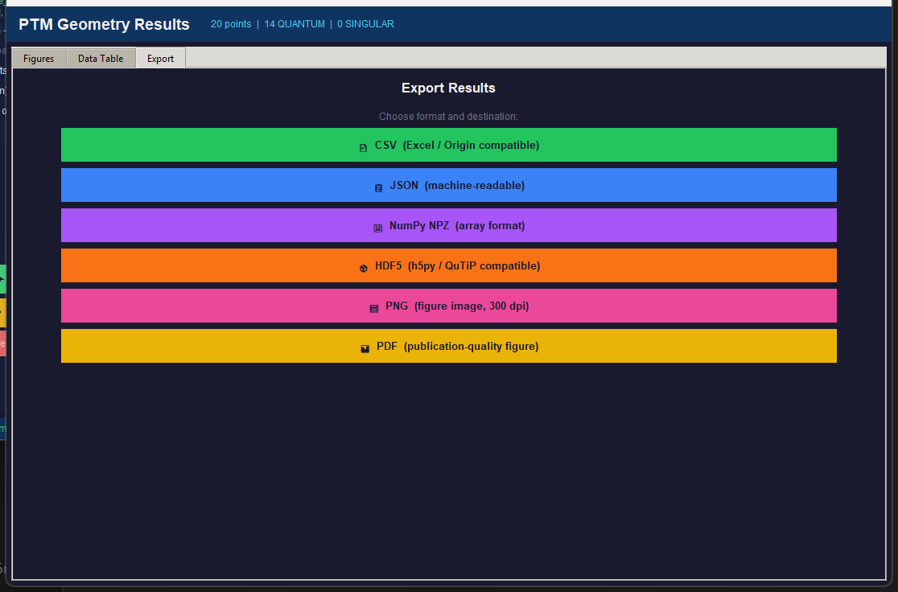

# JILA Pipeline — Complete User Guide

**For researchers in the Rey group and collaborators.**  
No programming experience is required to follow these steps.

> **What does this tool do?**  
> The JILA Pipeline is a desktop app that analyses data from OAT (one-axis twisting) quantum experiments. You load your data, click a button, and it produces publication-ready plots and numbers — including the teleportation fidelity and quantum phase classification for each measurement point. For large datasets, it can send the computation to a powerful Google Cloud TPU in one click.

---

## Before You Begin — One-Time Setup

You only need to do this once. Skip to [Step 1](#step-1--open-the-application) if you have already set up the tool.

### 1. Check that Python is installed

Open a terminal window:
- **Windows:** Press `Win + R`, type `cmd`, press Enter
- **Mac:** Press `Cmd + Space`, type `Terminal`, press Enter

Type this and press Enter:
```
python --version
```

You should see something like `Python 3.10.12`. If you see an error, download Python from [python.org](https://python.org) (version 3.9 or newer).

### 2. Install the required packages

In the same terminal window, navigate to the project folder (replace the path with wherever you saved it):
```
cd C:\path\to\emergent_quantum_geometries
```

Then install dependencies:
```
pip install -r requirements_gui.txt
```

This takes about a minute and only needs to be done once.

### 3. (For TPU cloud runs only) Install Google Cloud tools

If you only plan to run analyses locally on your own computer, skip this. You only need this for the "Deploy to TPU" feature.

1. Download and install the **Google Cloud CLI** from: https://cloud.google.com/sdk/docs/install
2. After installing, open a terminal and run:
   ```
   gcloud auth login
   ```
   This will open a browser window — sign in with the Google account associated with your TRC (TPU Research Cloud) grant.
3. Set your project:
   ```
   gcloud config set project time-emission
   ```

> **What is a TRC grant?** The TPU Research Cloud program gives researchers free access to Google's TPU hardware for scientific computing. The project ID `time-emission` is your allocated project. This grants you access to v6e-8 chips in Europe and the US.

---

## Step 1 — Open the Application

In a terminal, navigate to the project folder and run:

```
python jila_gui.py
```

The dashboard appears:



> 📷 **Screenshot needed here:** App at first launch — no file loaded, status bar says "Ready".

**What you see:**
- **Left panel** — Load your data file and configure settings
- **Right panel** — Live progress tracker for the pipeline (shows stages: Queue → Creating TPU → Node Ready → Uploading → Running → Results)
- **Status bar** at the bottom shows the current state

> **Tip:** If nothing appears after 10 seconds, make sure you ran `pip install -r requirements_gui.txt` in Step 0.

---

## Step 2 — Load Your Data File

Click the **"Browse / Select File"** button at the top of the left panel. A file-picker dialog opens — navigate to your data file and click Open.



> 📷 **Screenshot needed here:** App after loading `sample_phase_diagram_2d.npz`. The file name and row count appear below the button, and the column mapping section populates.

**Supported file types:**

| Format | Extension | Common source |
|--------|-----------|---------------|
| **NumPy archive** | **`.npz`** | **Recommended — from `np.savez()`** |
| Spreadsheet | `.csv` | Excel, LabVIEW, custom scripts |
| HDF5 | `.h5` | Large datasets |
| MATLAB | `.mat` | MATLAB post-processing |

> **Don't have a file yet?** Use the sample file included in the project:  
> `sample_data/sample_phase_diagram_2d.npz`  
> It contains 50 rows of synthetic OAT sweep data — perfect for testing.

After loading, you will see:
- The filename and row count displayed below the Browse button
- **Column mapping** dropdowns appear — see Step 3

---

## Step 3 — Map Your Column Names

Your data file may use different names for the physical quantities (for example, your file might call the squeezing parameter `Omega_chi` instead of `chi_t`). The column mapping dropdowns let you tell the app which column is which.


> 📷 **Screenshot needed here:** Close-up of the column mapping section with dropdowns set correctly.

Match each row to the correct column from your file:

| Row label | What to select | Physical meaning |
|-----------|---------------|-----------------|
| **N (atom number / qubits)** | Your atom count column | Number of atoms in the ensemble |
| **chi_t (interaction param)** | Your squeezing parameter column | OAT interaction strength × time |
| **gamma_t (dephasing, opt.)** | Your decoherence column, or leave as `0` | Decay rate × time — optional |
| **T_xx (measured, opt.)** | Measured T-matrix component, or leave blank | Optional experimental override |
| **T_yz (measured, opt.)** | Measured T-matrix component, or leave blank | Optional experimental override |

> **If you don't have a gamma column:** Leave it set to `0`. The pipeline assumes no decoherence, which is appropriate for ideal theory data.

---

## Step 4 — Configure Parameters

Below the column mapping, fill in the parameter fields:

| Field | Default | What it is |
|-------|---------|-----------|
| **GCP Project** | `time-emission` | Your Google Cloud project ID (only matters for TPU runs) |
| **Node ID** | `jila-run-node` | A name for the TPU machine — you can leave the default |
| **QR ID** | `jila-run-qr` | A name for the reservation ticket — you can leave the default |
| **TPU Zone / Type** | `v6e-8 · europe-west4-a (spot)` | Which Google Cloud region and chip to use |

> For local runs (no cloud), you can ignore the GCP fields entirely.

---

## Step 5 — Run the Analysis

You have two options depending on the size of your dataset:

### Option A — Run Locally (small datasets, < 200 rows)

Click the **green "▶ Run Locally (CPU)"** button.

The pipeline processes your data immediately on your computer. For 50 rows, this takes under 5 seconds.



> 📷 **Screenshot needed here:** App after a completed local run — log panel showing chi/F/rank lines, green status bar.

The log panel on the right fills with one line per data point, for example:
```
chi=0.500  F=0.7421  rank=3  [QUANTUM]
chi=1.200  F=0.6891  rank=3  [QUANTUM]
chi=2.500  F=0.6234  rank=2  [CLASSICAL]
```

- `F` = teleportation fidelity (above 0.667 = quantum advantage over classical)
- `rank` = 2 means classical channel; 3 means quantum-entangled channel
- `[QUANTUM]` / `[CLASSICAL]` = phase classification

### Option B — Deploy to TPU (large datasets or speed)

Click the **yellow "🚀 Deploy to TPU (TRC)"** button.

The pipeline submits your job to a Google Cloud TPU node. The progress tracker on the right shows each stage:

```
In Queue → Creating TPU → Node Ready → Uploading → Running → Results
```



> 📷 **Screenshot needed here:** App mid-TPU-run with the progress stepper showing "Node Ready" or "Uploading" highlighted.

**What each stage means:**

| Stage | What's happening | Typical time |
|-------|-----------------|-------------|
| **In Queue** | Waiting to submit | < 5 seconds |
| **Creating TPU** | Google Cloud is allocating a machine | 1–5 minutes |
| **Node Ready** | Machine is booting and SSH is becoming available | 1–3 minutes |
| **Uploading** | Your data is being sent to the cloud machine | 30–60 seconds |
| **Running** | Your pipeline is computing on the TPU | 1–10 minutes |
| **Results** | Results are being downloaded back to your computer | 30 seconds |

> **Spot instances:** The default zone uses "spot" (preemptible) machines, which are free under the TRC grant but can occasionally be interrupted by Google. If a run is interrupted, the app will clean up automatically and you can try again. If `europe-west4-a` is congested, try switching the zone to `v6e-8 · us-east1-d (spot)` in the dropdown.

---

## Step 6 — View and Export Results

When the run completes (either local or TPU), the Results window opens automatically:



> 📷 **Screenshot needed here:** The results window showing the six-panel figure after a completed run.

**The six panels:**

| Panel | What it shows |
|-------|--------------|
| **F_avg** | Average teleportation fidelity vs. χt. The dashed line at 2/3 marks where quantum advantage begins. |
| **T_xx** | Diagonal component of the process tensor matrix. |
| **T_yz** | Off-diagonal component — sensitive to entanglement asymmetry. |
| **Concurrence** | Entanglement measure (0 = no entanglement, 1 = maximum entanglement). |
| **PTM Rank** | Whether each point is a rank-2 (classical) or rank-3 (quantum) channel. |
| **Phase Boundary** | A scatter plot of all your data points, colour-coded by phase. |

Click the **"Data Table"** tab to see all numbers as a spreadsheet:



> 📷 **Screenshot needed here:** The Data Table tab showing columns: chi_t, F_avg_theory, ptm_rank, phase_class, etc.

Click the **"Export"** tab to save your results:



> 📷 **Screenshot needed here:** The Export tab showing all download buttons.

**Which format should I use?**

| Button | Best for |
|--------|----------|
| **CSV** | Opening in Excel, sharing with collaborators |
| **JSON** | Full-precision archiving |
| **NPZ** | Loading back into Python |
| **HDF5** | MATLAB (`h5read`) or large datasets |
| **PNG (300 dpi)** | Presentations, Word documents |
| **PDF** | Journal submission (vector, infinitely scalable) |

---

## Step 7 — Delete Cloud Resources (TPU runs only)

> ⚠️ **This step is mandatory after every TPU run.** Leaving a cloud machine running wastes your TRC allocation (and can incur charges if allocation is exceeded). The app attempts to delete automatically when a run finishes or fails — but always verify.

After a TPU run, click the **red "🗑 Delete TPU Resources (Cleanup)"** button.

A confirmation dialog appears — click **Yes**. The log panel will show:

```
── TRC Cleanup ──
✓ Delete node
✓ Delete QR
TRC verified: zero resources remain.
```

You can also verify from a terminal at any time:
```
gcloud compute tpus queued-resources list --project=time-emission
```
This should return **no rows** when you are clean.

---

## Troubleshooting

### The app

| Problem | Solution |
|---------|----------|
| `python: command not found` | Install Python 3.9+ from [python.org](https://python.org) |
| `No module named 'numpy'` | Run `pip install -r requirements_gui.txt` |
| Window appears blank or crashes immediately | Run `python -m pip install --upgrade pillow` |
| CSV file doesn't load | Make sure the first row contains column headers (names, not data) |
| Results window doesn't open | Check the log panel for red lines — usually an empty column mapping |

### TPU / Cloud

| Problem | Solution |
|---------|----------|
| `QR create failed (rc=2)` | The `gcloud` command is wrong — update the app to the latest version |
| `PERMISSION_DENIED` on create or delete | Your GCP billing account may not be linked. Go to [console.cloud.google.com/billing](https://console.cloud.google.com/billing) and check that `time-emission` is linked to **"My Billing Account TPU"**, not any other account |
| SSH never connects (probe 1/12, 2/12 …) | The spot node may have been preempted (interrupted by Google). The app detects this and cleans up automatically. Try again — it usually succeeds on the second attempt |
| `gcloud: command not found` | Install the Google Cloud CLI from [cloud.google.com/sdk](https://cloud.google.com/sdk/docs/install) |
| Node stuck in `PROVISIONING` for > 10 min | This zone has no capacity right now. Click **Delete TPU Resources**, then change the zone dropdown to `v6e-8 · us-east1-d (spot)` and try again |
| Delete button does nothing | Make sure you are using the latest version of the app. Earlier versions had a threading bug where the confirmation dialog was invisible on Windows |

---

## The Complete Workflow at a Glance

```
python jila_gui.py
       │
       ▼
Browse / Select File  ──►  your .npz, .csv, .h5, or .mat file
       │
       ▼
Map column names  ──►  chi_t, N, gamma_t (optional)
       │
       ├── Small dataset? ──► ▶ Run Locally (CPU)  ──────────────────┐
       │                                                               │
       └── Large dataset? ──► 🚀 Deploy to TPU (TRC)                  │
                               │                                       │
                               ▼                                       ▼
                         In Queue → Creating TPU →           Results window opens
                         Node Ready → Uploading →              (6-panel figure +
                         Running → Results                      data table + export)
                               │                                       │
                               ▼                                       ▼
                    🗑 Delete TPU Resources             Export: CSV / PDF / PNG / HDF5
                         (always do this!)
```

---

## Getting Help

If something goes wrong that isn't covered here:

1. Look at the **log panel** on the right side of the main window — red lines show exactly what failed
2. Copy the log text and open an issue on the project repository
3. Contact the pipeline maintainer and include: (a) the log text, (b) what file you loaded, (c) which button you pressed

The log panel is the single most useful piece of information for diagnosing any problem.
