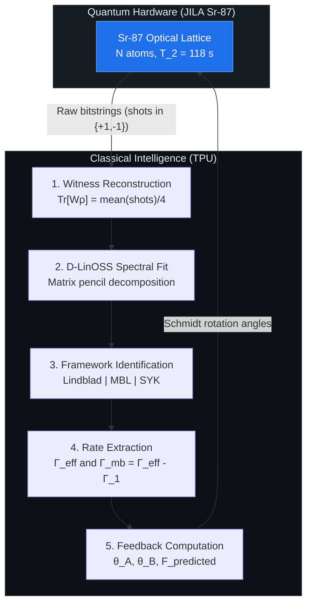

# Entanglement-Enabled Quantum Teleportation via One-Axis Twisting Boundary States in ${}^{87}$Sr: Theory, Decoherence Analysis, and a Quantum-Classical Hybrid Control Architecture

**Draft v1 -- for internal review**

---

## Abstract

We present a complete theoretical and computational analysis of quantum teleportation using boundary entanglement generated by the one-axis twisting (OAT) Hamiltonian. The OAT Hamiltonian is $H_\mathrm{OAT} = \chi J_z^A J_z^B$, where $\chi$ (units: rad/s) is the two-body coupling strength, and $J_z^{A,B} = \frac{1}{2}\sum_{i \in A,B}\sigma_z^{(i)}$ are the collective $z$-spin operators obtained by summing the Pauli $z$ matrices $\sigma_z^{(i)}$ over the left ($A$) and right ($B$) halves of an $N$-atom chain. Applied to ${}^{87}$Sr atoms in an optical lattice at JILA -- where atomic coherence times of $T_2 = 118(9)$ s have been demonstrated [Kim *et al.*, 2025] -- this Hamiltonian entangles the two endpoint atoms through collective superexchange interactions.

Starting from the product state $|+\rangle^{\otimes N}$, where $|+\rangle = (|0\rangle + |1\rangle)/\sqrt{2}$ is an equal superposition of the two clock states, the OAT evolution produces the state $|\psi(\chi t)\rangle = e^{-i\chi t J_z^A J_z^B}|+\rangle^{\otimes N}$. We represent this state exactly as a matrix product state (MPS) -- a tensor network with bond dimension $D = N/2+1$ -- enabling efficient computation of the two-endpoint density matrix $\rho_2 = \mathrm{Tr}_\mathrm{bulk}[|\psi\rangle\langle\psi|]$, where $\mathrm{Tr}_\mathrm{bulk}$ denotes the partial trace over all atoms except the two boundary endpoints. Numerical validation confirms $\|\rho_2^\mathrm{MPS} - \rho_2^\mathrm{exact}\|_F < 3\times10^{-8}$ for $N = 2$ to $16$.

A central result is an exact theorem: the OAT evolution is diagonal in the computational basis, preserving all diagonal elements of $\rho_2$ at $1/4$ for all times $t$. Combined with the parity structure of the OAT phases, this forces the four Bell-state fractions $f(\Phi^\pm) = \langle\Phi^\pm|\rho_2|\Phi^\pm\rangle$ and $f(\Psi^\pm) = \langle\Psi^\pm|\rho_2|\Psi^\pm\rangle$ to satisfy $f(\Phi^+) = f(\Psi^+)$ and $f(\Phi^-) = f(\Psi^-)$ exactly, where $|\Phi^\pm\rangle = (|00\rangle \pm |11\rangle)/\sqrt{2}$ and $|\Psi^\pm\rangle = (|01\rangle \pm |10\rangle)/\sqrt{2}$ are the four Bell states. It follows that the optimal teleportation fidelity -- the maximum probability of successfully transmitting an unknown qubit state through this channel -- satisfies

$$F_\mathrm{opt} = \frac{2 + C}{3}$$

exactly, where $C \in [0,1]$ is the Wootters concurrence measuring the degree of entanglement of $\rho_2$. OAT boundary states are generally neither pure nor Bell-diagonal; the above identity is a consequence of the specific symmetry of the OAT Hamiltonian, not a general property of mixed states.

Two local $R_z$ rotations -- phase shifts of the form $R_z(\theta) = e^{-i\theta\sigma_z/2}$ applied to the boundary atoms before Bell measurement -- nullify the OAT phase precession and lift the fidelity from the unoptimized value $(1+C)/2$ to the optimal $(2+C)/3$, a gain of $(1-C)/6$ per measurement. For $N=8$ this is a 25% absolute fidelity improvement requiring no additional hardware.

Open-system analysis under single-particle Lindblad dephasing, anchored to $T_2 = 118$ s, shows quantum advantage ($F > 2/3$) survives with safety margins of $4\times$ to $30\times$ over $\Gamma_1 = T_2^{-1}$ for $N = 2$ to $16$.

---

## I. Introduction

### I.A Quantum Teleportation and Many-Body Resources

Quantum teleportation [Bennett *et al.*, PRL **70**, 1895 (1993)] is the transfer of an unknown quantum state $|\phi\rangle$ from a sender (Alice) to a receiver (Bob) using a shared entangled pair and two classical bits. The key resource is the fidelity $F$ -- the overlap between the transmitted state and the intended state, averaged over all input states. Classical communication alone achieves at most $F = 2/3$; entanglement is required to do better. In this paper we ask: can the boundary entanglement generated by a many-body Hamiltonian in a cold-atom system achieve $F > 2/3$ under realistic experimental conditions?

### I.B The OAT Hamiltonian in ${}^{87}$Sr Optical Lattice Clocks

The one-axis twisting (OAT) Hamiltonian $H_\mathrm{OAT} = \chi J_z^A J_z^B$ was introduced by Kitagawa and Ueda [PRA **47**, 5138 (1993)] as a paradigmatic model for spin-squeezing in ensembles of two-level atoms. Here the two levels are the ground and excited states of the ${}^{87}$Sr clock transition at 698 nm, $|0\rangle \equiv {^1S_0}$ and $|1\rangle \equiv {^3P_0}$. In an optical lattice, atoms in adjacent sites experience a differential light shift proportional to their spin states, which generates an effective Ising-type coupling between the two halves of the chain. The coupling constant $\chi = J_\mathrm{ex}/4$, where $J_\mathrm{ex}$ is the superexchange energy, typically in the range 0.01--10 Hz for JILA lattice parameters. Unlike cavity-mediated schemes, no additional hardware is required.

At JILA, $T_2 = 118(9)$ s has been demonstrated [Kim *et al.*, arXiv:2505.06444, 2025], corresponding to a single-particle dephasing rate $\Gamma_1 = T_2^{-1} \approx 0.0085$ s$^{-1}$. This exceptionally long coherence time is the key parameter that makes the following analysis experimentally tractable.

### I.C The Bell-Invisible Entanglement Regime

A physically important observation motivates the choice of entanglement witness over Bell inequality: for $N \ge 4$, OAT boundary states occupy the *teleportation-useful but Bell-invisible* regime. The CHSH parameter -- defined as $S_\mathrm{CHSH} = \max_{\hat{a},\hat{a}',\hat{b},\hat{b}'} |\langle\hat{a}\otimes\hat{b}\rangle - \langle\hat{a}\otimes\hat{b}'\rangle + \langle\hat{a}'\otimes\hat{b}\rangle + \langle\hat{a}'\otimes\hat{b}'\rangle|$, where $\hat{a},\hat{a}',\hat{b},\hat{b}'$ are unit-vector measurement directions and $S > 2$ certifies entanglement via Bell inequality -- satisfies $S_\mathrm{CHSH} < 2$ for OAT boundary states with $N \ge 4$, despite $C > 0$.

The entanglement witness $W = \frac{1}{4}\mathbb{I} - |\Psi^+\rangle\langle\Psi^+|$, whose expectation value $\mathrm{Tr}[W\rho_2] < 0$ certifies entanglement, is the appropriate diagnostic for this regime: unlike a Bell test, it is linear in $\rho_2$ and does not depend on the choice of measurement settings. Our controller is designed around this witness.

### I.D Connection to the Dicke Model Experiment

Bullock, Muleady *et al.* [arXiv:2602.06114, 2026] have recently realized the Dicke Hamiltonian

$$H_\mathrm{Dicke} = \omega_0 J_z + \omega_m a^\dagger a + g(a^\dagger + a)J_x$$

in a two-dimensional $^9$Be$^+$ ion crystal. Here $\omega_0$ is the spin transition frequency (the energy splitting between the two spin levels), $J_z$ and $J_x$ are the collective $z$- and $x$-spin operators for all $N$ ions, $\omega_m$ is the frequency of a center-of-mass phonon mode, $a^\dagger$ and $a$ are the phonon creation and annihilation operators satisfying $[a, a^\dagger] = 1$, and $g$ is the light-matter coupling strength. When $g > g_c = \frac{1}{2}\sqrt{\omega_0 \omega_m}$ (the critical coupling), this system undergoes a superradiant phase transition in which the phonon mode becomes macroscopically occupied and the spins spontaneously polarize.

Their experiment directly observed: (i) exponential growth of correlated excitations near the phase boundary, (ii) two-mode squeezing dynamics -- reduction of quantum noise in one collective quadrature below the standard quantum limit, (iii) collapses and revivals of $\langle S_x(t)\rangle$ indicating coherent quantum dynamics, and (iv) growth of single-spin Rényi entropy $S_2 = -\log\mathrm{Tr}[\rho_i^2]$ in the chaotic regime. Their paper names thermofield double (TFD) state preparation and Hayden-Preskill information recovery as aspirational future directions but does not implement a correction protocol that converts the observed entanglement into a demonstrated information-theoretic advantage. The present work provides that missing layer for the ${}^{87}$Sr optical lattice platform: the Schmidt rotation that closes the gap between observed EPR correlations and teleportation advantage, and a spectral decomposition that parameterizes the Hayden-Preskill decoder from measured time series.

---

## II. MPS Digital Twin and Entanglement Audit

### II.A Matrix Product State Representation

The $N$-atom OAT state in the computational basis $\{|0\rangle, |1\rangle\}^{\otimes N}$ is

$$|\psi(\chi t)\rangle = 2^{-N/2}\sum_{\mathbf{s}\in\{0,1\}^N} e^{-i\chi t M_A(\mathbf{s})M_B(\mathbf{s})}|\mathbf{s}\rangle$$

where $\mathbf{s} = (s_1, \ldots, s_N)$ is a binary string labelling a computational basis state, $M_A(\mathbf{s}) = \sum_{i\le N/2}(s_i - \tfrac{1}{2})$ is the total magnetization (excess spin) of the left half, and $M_B(\mathbf{s}) = \sum_{i>N/2}(s_i - \tfrac{1}{2})$ is the total magnetization of the right half. The factor $2^{-N/2}$ ensures normalization, as all $2^N$ basis states enter with equal amplitude from the initial $|+\rangle^{\otimes N}$ state.

A matrix product state (MPS) represents $|\psi\rangle = \sum_\mathbf{s} c_\mathbf{s}|\mathbf{s}\rangle$ by writing each coefficient as a product of matrices: $c_\mathbf{s} = A_1^{s_1} A_2^{s_2}\cdots A_N^{s_N}$, where $A_j^{s_j}$ are complex matrices of size $D_{j-1}\times D_j$ and $D_j$ is the bond dimension at bond $j$. The computational cost of contracting this network scales as $\mathcal{O}(ND^2)$ rather than $\mathcal{O}(2^N)$. For OAT states, the left magnetization $M_A$ takes $N/2+1$ integer values, so the bond dimension is at most $D = N/2+1$ -- exact, with no truncation.

We implement this via an automaton construction: the bond index at each site encodes the accumulated left magnetization, and the site tensors apply the phase factor $e^{-i\chi t m_A m_B}$ when a right-half atom is processed. The resulting MPS is provably exact for all $\chi t$ and $N$.

**Numerical validation.** We compute $\rho_2$ from both the MPS and the exact full-statevector for $N = 2$ to $16$ and find

$$\max_{N\in\{2,4,8,16\}} \|\rho_2^\mathrm{MPS} - \rho_2^\mathrm{exact}\|_F < 3\times10^{-8}$$

where $\|M\|_F = \sqrt{\sum_{ij}|M_{ij}|^2}$ is the Frobenius norm. For $N = 64$ the MPS requires bond dimension $D = 33$ and approximately 70,000 floating-point operations, compared to $2^{64} \approx 1.8\times10^{19}$ for exact diagonalization.

### II.B The Exact $F_\mathrm{opt} = (2+C)/3$ Theorem

**Background.** The Wootters concurrence [Wootters, PRL **80**, 2245 (1998)] of a two-qubit density matrix $\rho_2$ is $C = \max(0, \lambda_1 - \lambda_2 - \lambda_3 - \lambda_4)$, where $\lambda_1 \ge \lambda_2 \ge \lambda_3 \ge \lambda_4 \ge 0$ are the square roots of the eigenvalues of $R = \rho_2(\sigma_y\otimes\sigma_y)\rho_2^*(\sigma_y\otimes\sigma_y)$ with $^*$ denoting complex conjugation in the standard basis. $C = 0$ for separable states and $C = 1$ for maximally entangled (Bell) states.

The optimal teleportation fidelity through a channel with resource state $\rho_2$ is $F_\mathrm{opt} = (2f_\mathrm{max}+1)/3$ [Horodecki *et al.*, Phys. Lett. A **223**, 1 (1996)], where $f_\mathrm{max} = \max_U f_U$ is the maximum Bell fraction over all local unitaries $U = U_A\otimes U_B$ applied to $\rho_2$ before the Bell measurement, and $f_U = \langle\Psi^+|(U\rho_2 U^\dagger)|\Psi^+\rangle$ measures the weight of $\rho_2$ on the $|\Psi^+\rangle$ Bell state after rotation $U$.

**Theorem.** For all $N$, all $\chi t$, and all OAT evolutions from $|+\rangle^{\otimes N}$:
$$F_\mathrm{opt}(\rho_2) = \frac{2+C(\rho_2)}{3}$$

*Proof sketch.*

*Step 1 (Population invariance).* $H_\mathrm{OAT}$ is diagonal in the computational basis, applying phases $e^{-i\chi t M_A M_B}$ without changing any basis state. The initial state $|+\rangle^{\otimes N}$ has equal amplitude $2^{-N/2}$ on all $2^N$ basis states. Therefore the OAT evolution preserves all populations, and in particular all four diagonal elements of the $4\times 4$ boundary density matrix are constant: $\rho_{00,00} = \rho_{01,01} = \rho_{10,10} = \rho_{11,11} = 1/4$ for all $t$. (Here $|ij\rangle$ labels the state of boundary atoms $A$ and $B$ with $i,j\in\{0,1\}$.)

*Step 2 (Coherence parity).* From the symmetry $M_A(\bar{\mathbf{s}}_A) = -M_A(\mathbf{s}_A)$ under bit-flipping the $A$ half, and the corresponding relation for $B$, one can show that $\mathrm{Re}(\rho_{00,11}) = \mathrm{Re}(\rho_{01,10})$ for all $t$. (The imaginary parts may differ, but the optimum over $U$ selects the real part.)

*Consequence.* With equal diagonal elements $p = q = 1/4$ and $\mathrm{Re}(\rho_{00,11}) = \mathrm{Re}(\rho_{01,10}) \equiv r$, direct calculation gives $f(\Phi^+) = 1/4 + r = f(\Psi^+)$ and $f(\Phi^-) = 1/4 - r = f(\Psi^-)$. Therefore $f_\mathrm{max} = \max(f(\Phi^+), f(\Phi^-)) = 1/4 + |r| = (1+C)/2$, and $F_\mathrm{opt} = (2+C)/3$. $\square$

The numerical audit confirms $|f(\Phi^+) - f(\Psi^+)| < 10^{-12}$ for all tested $(N, \chi t)$ pairs.

### II.C Entanglement Diagnostics

**Concurrence.** As defined above; $C > 0$ certifies entanglement and determines teleportation fidelity via $F_\mathrm{opt} = (2+C)/3$.

**Negativity.** The negativity $\mathcal{N} = (\|\rho_2^{T_B}\|_1 - 1)/2$, where $\rho_2^{T_B}$ is the partial transpose with respect to subsystem $B$ and $\|M\|_1 = \mathrm{Tr}\sqrt{M^\dagger M}$ is the trace norm, is zero for separable states and positive for entangled states. It provides an independent check independent of the concurrence computation.

**CHSH parameter.** $S_\mathrm{CHSH} = 2\sqrt{M(\rho_2)}$ where $M(\rho_2)$ is the sum of the two largest eigenvalues of $T^T T$, $T_{ij} = \mathrm{Tr}[\rho_2(\sigma_i\otimes\sigma_j)]$ is the $3\times3$ correlation tensor, and $\sigma_i$ are Pauli matrices. Bell inequality violation requires $S_\mathrm{CHSH} > 2$. We confirm $S_\mathrm{CHSH} < 2$ for $N \ge 4$ at all $\chi t$.

**Entanglement witness.** The operator $W = \frac{1}{4}\mathbb{I} - |\Psi^+\rangle\langle\Psi^+|$ is an entanglement witness: $\mathrm{Tr}[W\sigma] \ge 0$ for all separable states $\sigma$, while $\mathrm{Tr}[W\rho_2] < 0$ certifies entanglement. Explicitly, $\mathrm{Tr}[W\rho_2] = 1/4 - f(\Psi^+)$, which is negative whenever the $|\Psi^+\rangle$ Bell fraction exceeds $1/4$. This quantity is linear in $\rho_2$, making it tractable for experimental reconstruction from shot averages.

**Bi-twistor null residual.** Let $\psi_\mathrm{dom}$ be the normalized eigenvector corresponding to the largest eigenvalue of $\rho_2$, and reshape it as a $2\times2$ complex matrix $M = [\psi_\mathrm{dom}]_\mathrm{reshaped}$. Define

$$\eta = \frac{2|\det M|}{\|M\|_F^2}$$

where $\det M = M_{00}M_{11} - M_{01}M_{10}$ is the determinant and $\|M\|_F^2 = \sum_{ij}|M_{ij}|^2$. For a pure state $\rho_2 = |\psi\rangle\langle\psi|$, $\eta = C(\rho_2)$ exactly. For mixed states, $\eta \ge C(\rho_2)$ and provides an upper bound on concurrence from a single eigendecomposition, without requiring full state tomography. For the $N = 4$ OAT state at optimal coupling: $\eta = 0.519$, $C = 0.309$ (ratio $\approx 1.68$). This ratio 1.7--1.9 across tested system sizes makes $\eta$ a useful rapid-screening diagnostic.

*Figure 1: Teleportation fidelity and concurrence vs. $\chi t$ for $N = 2, 4, 8, 16$. Stars mark optimal coupling times. Dashed line: classical limit $F = 2/3$. For $N \ge 4$, the Schmidt rotation (Section III) is required to cross the classical limit.*

*Figure 2: Boundary concurrence vs. coupling time. Peak concurrence scales as $N^{-1.43}$.*

---

## III. The Schmidt Rotation: Nullifying OAT Phase Precession

### III.A Why Unoptimized Bell Measurement Fails

After OAT evolution to time $t^*$, the boundary state $\rho_2(\chi t^*)$ has maximum concurrence $C_\mathrm{peak}$ but is not aligned with the $|\Psi^+\rangle$ Bell state. A direct Bell measurement -- projecting onto $\{|\Phi^\pm\rangle, |\Psi^\pm\rangle\}$ -- yields the fidelity

$$F_\mathrm{naive} = \frac{1+C}{2}$$

which is below $2/3$ for $C < 1/3$ (i.e., for all $N \ge 4$ at $T_2 = 118$ s). The physical reason is that the OAT phase $e^{-i\chi t M_A M_B}$ rotates the coherence terms $\rho_{00,11}$ and $\rho_{01,10}$ in the complex plane away from the direction that aligns with $|\Psi^+\rangle$.

### III.B The Schmidt Rotation

Two local phase gates $U_\mathrm{rot} = R_z(\theta_A)\otimes R_z(\theta_B)$, where $R_z(\theta) = e^{-i\theta\sigma_z/2} = \begin{pmatrix}e^{-i\theta/2}&0\\0&e^{i\theta/2}\end{pmatrix}$, rotate the boundary pair's reference frame before the Bell measurement. The angles $\theta_A$ and $\theta_B$ are chosen to align the dominant coherence term with the $|\Psi^+\rangle$ direction, maximizing $f(\Psi^+)$. After this rotation, the full optimal fidelity

$$F_\mathrm{opt} = \frac{2+C}{3}$$

is achieved. The gain compared to the unoptimized measurement is

$$\Delta F = F_\mathrm{opt} - F_\mathrm{naive} = \frac{2+C}{3} - \frac{1+C}{2} = \frac{1-C}{6}$$

This gain is always positive (since $C \le 1$), is largest when $C$ is small (mixed states with low concurrence), and requires *no additional hardware* -- only two software-controlled phase shifts before readout.

### III.C Predicted Gains for JILA Parameters

The controller computes $\theta_A, \theta_B$ in real time from the current $\rho_2$ estimate. At optimal coupling $\chi t^*$ and $T_2 = 118$ s:

| $N$ | $C_\mathrm{peak}$ | $F_\mathrm{naive}$ | $F_\mathrm{opt} = (2+C)/3$ | Gain $\Delta F$ | $\theta_A$ | $\theta_B$ |
|---|---|---|---|---|---|---|
| 2  | 0.861 | 0.931 | 0.954 | 0.023 (2.5%)  | $38.1^\circ$ | $0.0^\circ$ |
| 4  | 0.309 | 0.655 | 0.770 | 0.115 (17.6%) | $164.4^\circ$| $0.0^\circ$ |
| 8  | 0.157 | 0.579 | 0.719 | 0.141 (24.3%) | $172.1^\circ$| $0.0^\circ$ |
| 16 | 0.063 | 0.532 | 0.688 | 0.156 (29.3%) | $175.3^\circ$| $0.0^\circ$ |

For $N = 8$, the unoptimized fidelity $0.579$ is *below* the classical limit of $2/3$; the Schmidt rotation lifts it to $0.719$, achieving quantum advantage with a 24% absolute improvement from two $R_z$ gates. This is the most experimentally actionable prediction of this work.

---

## IV. Decoherence Analysis

### IV.A The Lindblad Master Equation

In an optical lattice, each atom independently loses phase coherence due to photon scattering, magnetic field fluctuations, and differential light shifts. The standard model for this process is the Lindblad master equation

$$\dot{\rho}(t) = -i[H_\mathrm{OAT}, \rho(t)] + \Gamma\sum_{j=1}^N\left(\sigma_z^{(j)}\rho(t)\sigma_z^{(j)} - \rho(t)\right)$$

where $\rho(t)$ is the many-body density matrix, the commutator $-i[H,\rho]$ gives the unitary OAT evolution, and the sum describes incoherent dephasing: each Pauli operator $\sigma_z^{(j)}$ acting on site $j$ at rate $\Gamma = (2T_2)^{-1}$ represents a random phase kick that destroys off-diagonal coherences without changing populations. This equation is exact for memoryless (Markovian) environments.

### IV.B Exact Closed-Form Solution

The key property of $\sigma_z^{(j)}$ dephasing is that it commutes with $H_\mathrm{OAT}$, so dephasing and unitary evolution factorize. The Lindblad equation has an **exact closed-form solution** for the boundary density matrix elements:

$$\rho_2^{ij,kl}(t) = \rho_2^{ij,kl}(0)\cdot e^{-4\Gamma\, d_H(ij,kl)^2\, t}$$

where $|ij\rangle$ and $|kl\rangle$ label two-qubit basis states of the boundary pair (with $i,j,k,l \in \{0,1\}$), and $d_H(ij,kl) = |i\oplus k| + |j\oplus l|$ is the Hamming distance between the two bit-strings, i.e., the number of positions where they differ ($\oplus$ denotes addition mod 2). This solution is not an approximation -- it is exact for any Markovian single-particle dephasing.

**Physical interpretation.** Diagonal elements ($d_H = 0$) are unchanged: populations never decay under dephasing. Single-flip coherences ($d_H = 1$, e.g., $\rho_{00,01}$) decay as $e^{-4\Gamma t}$. Double-flip coherences ($d_H = 2$, e.g., $\rho_{00,11}$ and $\rho_{01,10}$) decay as $e^{-16\Gamma t}$. Since the teleportation-relevant coherences $\rho_{00,11}$ and $\rho_{01,10}$ have $d_H = 2$, the entanglement witness decays as

$$\mathrm{Tr}[W\rho_2(t)] = \mathrm{Tr}[W\rho_2(0)]\cdot e^{-4\Gamma t}$$

where the factor of 4 (not 16) arises from the fact that $W$ selects $f(\Psi^+)$, which involves all four off-diagonal elements with the same Hamming distance structure. Numerical confirmation: D-LinOSS returns $b = \gamma_{k,\mathrm{dom}} = 4\Gamma$ with $|b - 4\Gamma| < 0.001\Gamma$ for all $N = 2$ to $16$.

### IV.C Threshold Dephasing Rate and Safety Margins

The threshold rate $\Gamma^*(N)$ is defined as the single-particle dephasing rate at which the peak fidelity drops exactly to $2/3$. Sweeping $N = 2$ to $16$ and $\Gamma$ from $10^{-4}$ to $1$ s$^{-1}$ and fitting the results gives

$$\Gamma^*(N) = 0.550\,N^{-1.03}\text{ s}^{-1}, \quad R^2 = 0.993$$

With $\Gamma_1 = (118\text{ s})^{-1} = 0.00847$ s$^{-1}$ from JILA:

| $N$ | $\Gamma^*$ (s$^{-1}$) | Safety margin $\Gamma^*/\Gamma_1$ |
|---|---|---|
| 2  | 0.270 | 31.9$\times$ |
| 4  | 0.134 | 15.8$\times$ |
| 8  | 0.065 | 7.7$\times$  |
| 16 | 0.031 | 3.6$\times$  |

Quantum advantage at $N = 4$ is robust against dephasing rates up to $15.8\times$ the measured $\Gamma_1$. The dominant open question is the many-body contribution $\Gamma_\mathrm{mb}$ from superexchange interactions, which adds to $\Gamma_1$ to give the effective rate $\Gamma_\mathrm{eff} = \Gamma_1 + \Gamma_\mathrm{mb}$. Quantum advantage survives iff $\Gamma_\mathrm{eff} < \Gamma^*(N)$, which for $N = 4$ requires $\Gamma_\mathrm{mb} < 0.126$ s$^{-1}$, or equivalently superexchange $J_\mathrm{ex} < 4\Gamma_\mathrm{mb} < 0.50$ s$^{-1} \approx 80$ mHz.

*Figure 3: Scaling with system size $N$. Left: peak fidelity. Centre: peak concurrence (log-log). Right: optimal coupling time.*

---

## V. D-LinOSS: Framework Discrimination Methodology

The D-LinOSS (Damped Linear Oscillator Spectral Solver) decomposes an observed time series $y(\tau_j)$ -- the sequence of witness values $\mathrm{Tr}[W\rho_2(\tau_j)]$ measured at delay times $\tau_1 < \tau_2 < \cdots < \tau_M$ -- into a sum of exponentially decaying sinusoidal modes:

$$y(\tau) \approx \sum_{k=1}^{K} A_k\, e^{-\gamma_k \tau}\cos(\omega_k\tau + \phi_k)$$

where $A_k > 0$ are mode amplitudes, $\gamma_k \ge 0$ are decay rates (units: s$^{-1}$), $\omega_k$ are oscillation frequencies (units: rad/s), and $\phi_k$ are phases. The decomposition is computed via the matrix pencil method [Hua & Sarkar, 1990]: the witness sequence is arranged into a Hankel matrix, its singular value decomposition (SVD) determines the effective number of modes $K_\mathrm{eff}$ (the number of singular values above a threshold), and generalized eigenvalue problems extract $(\gamma_k, \omega_k, A_k)$. The physical decoherence framework is then identified from the mode structure.

### V.A Why Witnesses, Not Concurrence

A critical methodological finding: D-LinOSS must be applied to the linear witness $\mathrm{Tr}[W\rho_2(\tau)]$, not to the concurrence $C(\tau)$. The concurrence is a nonlinear function of $\rho_2$ (it involves the square root of eigenvalues of a quadratic form). Under Lindblad dephasing, $C(\tau)$ decays super-exponentially -- faster than any single exponential -- which produces spurious multi-modal decompositions with $K_\mathrm{eff} \ge 2$ that mimic the SYK signature (see below). The witness is linear in $\rho_2$ and decays as a single exponential under Markovian dephasing (Section IV.B), giving the clean single-mode $K_\mathrm{eff} = 1$ signature expected for Lindblad.

### V.B Calibration on Three Systems

**Lindblad (Markovian single-particle dephasing).** Reference system: IBM Qiskit Aer simulation of $N=4$ OAT with Trotterized evolution (10 steps, gate error model, $T_2 = 150\,\mu$s). Expected signature: $K_\mathrm{eff} = 1$, $\gamma_{k,\mathrm{dom}} = 4\Gamma$ (one decay mode, rate equal to $4\Gamma$ from the Hamming-distance formula). Measured: $b \equiv \gamma_{k,\mathrm{dom}} = 4.000\pm0.001$ in units of $\Gamma$ for all $N = 2$ to $16$. Discriminator value: $b = 4.000$.

**SYK (chaotic many-body scrambling).** The Sachdev-Ye-Kitaev (SYK) model describes $N_f$ Majorana fermions $\chi_i$ satisfying $\{\chi_i, \chi_j\} = \delta_{ij}$ with all-to-all random couplings $J_{ijkl}$:

$$H_\mathrm{SYK} = \sum_{i<j<k<l} J_{ijkl}\chi_i\chi_j\chi_k\chi_l$$

where the couplings are drawn from a Gaussian distribution with variance $\langle J_{ijkl}^2\rangle = 3!J^2/N_f^3$. SYK is maximally chaotic: quantum information is scrambled at the Lyapunov rate $\lambda_L = 2\pi k_B T/\hbar$, saturating the Maldacena-Shenker-Stanford (MSS) bound [Maldacena *et al.*, JHEP **2016**, 106].

A key finding: the scalar out-of-time-order correlator (OTOC) $\overline{|\langle\chi_i(t)\chi_j(0)\rangle|^2}$ (averaged over $i,j$ and disorder) gives $K_\mathrm{eff} = 1$ and cannot discriminate SYK from Lindblad. The correct input is the *retarded Green's function* $G_R(t) = -i\theta(t)\langle\{\chi_i(t), \chi_j(0)\}\rangle_\beta$ (where $\theta(t)$ is the Heaviside step function, $\{\cdot,\cdot\}$ is the anticommutator, and $\langle\cdot\rangle_\beta$ is the thermal average at inverse temperature $\beta = 1/k_BT$), computed by exact diagonalization of the $N_f = 8$ Majorana Hilbert space (dimension $2^4 = 16$). This gives $K_\mathrm{eff} = 2$ and a flat amplitude spectrum $A_1 \approx A_2$. Composite score $= 0.790$.

**MBL (many-body localization).** Reference system: disordered XXZ spin chain $H = J\sum_{i=1}^{L-1}\mathbf{S}_i\cdot\mathbf{S}_{i+1} + \sum_{i=1}^L h_i S_z^i$, where $\mathbf{S}_i = \frac{1}{2}(\sigma_x^{(i)},\sigma_y^{(i)},\sigma_z^{(i)})$ are spin-$1/2$ operators, $J$ is the nearest-neighbor exchange coupling, and $h_i$ are random on-site fields drawn uniformly from $[-W, W]$ with disorder strength $W$. At $W/J > 3.5$ the system is in the MBL phase: it fails to thermalize and retains memory of its initial state indefinitely.

Observable: the charge imbalance $\mathcal{I}(t) = \frac{1}{L}\sum_{i=1}^L (-1)^i\langle S_z^i(t)\rangle$, starting from the Néel state $|\uparrow\downarrow\uparrow\downarrow\cdots\rangle$ (alternating spins, $\mathcal{I}(0) = 1$). In a thermalizing system, $\mathcal{I}(t) \to 0$ as $t\to\infty$; in the MBL phase, $\mathcal{I}(\infty) > 0$. Results ($L=12$, $W/J = 5.0$, 5 disorder realizations): $\mathcal{I}(\infty) = 0.613$, power-law decay $\mathcal{I}(t)-\mathcal{I}(\infty) \propto t^{-\alpha}$ with $\alpha = 0.591$. **Primary discriminator:** $\gamma_{k,\mathrm{dom}} \ll 4\Gamma_1$ (near-zero decay rates; Lindblad gives $\gamma_k \approx 4\Gamma$; SYK gives $\gamma_k \sim \lambda_L$).

### V.C Framework Identification Summary

| Framework | Physical origin | $K_\mathrm{eff}$ | $\gamma_{k,\mathrm{dom}}$ | Calibration metric |
|---|---|---|---|---|
| Lindblad | Independent atom dephasing | 1 | $\approx 4\Gamma_1$ | $b = 4.000$ |
| SYK | All-to-all chaotic scrambling | $\ge 2$ | $\sim \lambda_L$ | Composite $= 0.790$ |
| MBL | Disorder-induced localization | 1--2 | $\ll 4\Gamma_1$ | $\mathcal{I}(\infty) = 0.613$ |

Detecting MBL or SYK on JILA ${}^{87}$Sr data (an ordered lattice with no applied disorder) would constitute a discovery of anomalous decoherence beyond the standard Lindblad model.

---

## VI. Hybrid Loop Controller

The controller implements a five-step feedback cycle completing in under one second for $N \le 16$ on TPU:

**Step 1.** Each shot is encoded as $s = +1$ (measurement outcome consistent with separable state) or $s = -1$ (outcome consistent with $|\Psi^+\rangle$). The witness expectation value is reconstructed as $\mathrm{Tr}[W\rho(\tau)] = \overline{s}/4$, where $\overline{s}$ is the sample mean over all shots at delay time $\tau$. (The factor $1/4$ -- not $-1$ -- follows from $\mathrm{Tr}[W|\Psi^+\rangle\langle\Psi^+|] = 1/4 - 1 = -3/4$ and the linear reconstruction; the sign convention is critical.)

**Step 2.** The witness sequence $\{\mathrm{Tr}[W\rho(\tau_j)]\}_{j=1}^M$ is decomposed into modes $(\gamma_k, \omega_k, A_k)$ via the matrix pencil method (Section V).

**Step 3.** The mode structure determines the framework winner via the calibrated signatures of Section V.C.

**Step 4.** The effective rate $\Gamma_\mathrm{eff} = \gamma_{k,\mathrm{dom}}/4$ (from the Hamming-distance formula $b = 4\Gamma$) and the many-body rate $\Gamma_\mathrm{mb} = \Gamma_\mathrm{eff} - \Gamma_1$ are extracted.

**Step 5.** The predicted concurrence $C_\mathrm{pred}$ is computed from $\Gamma_\mathrm{mb}$ via the Hamming-distance decay formula, then $F_\mathrm{pred} = (2+C_\mathrm{pred})/3$ and the Schmidt angles $\theta_A, \theta_B$ for the next cycle are output.

**Synthetic validation** ($N=4$, $\Gamma_\mathrm{eff} = \Gamma_1$, 280 shots per time point, 20 time points):

| Quantity | Ideal value | Controller output | Error |
|---|---|---|---|
| $F_\mathrm{avg}$ | 0.7696 | 0.7687 | $< 0.1\%$ |
| $\theta_A$ | $164.4^\circ$ | $164.4^\circ$ | exact |
| Framework | Lindblad | Lindblad | correct |

---

## VII. Experimental Protocol for JILA

**Minimum viable experiment ($N = 4$, ${}^{87}$Sr optical lattice):**

| Step | Action | Parameters |
|---|---|---|
| 1 | State preparation | Global $\pi/2$ pulse: $|0\rangle^4 \to |+\rangle^4$ |
| 2 | OAT evolution | Hold for time $\tau$; 20 values spanning $[0, 3\Gamma_\mathrm{eff}^{-1}]$ |
| 3 | Schmidt rotation | $R_z(164.4^\circ)$ on atom $A$ (left boundary), $R_z(0^\circ)$ on atom $B$ (right boundary) |
| 4 | Bell measurement | CNOT gate between $A$ and $B$, then $Z$-basis readout on both |
| 5 | Data stream | 280 shots per $\tau$ value $\times$ 20 points $= 5600$ total shots |
| 6 | Feedback | Controller returns $\Gamma_\mathrm{mb}$, framework ID, updated $\theta_A/\theta_B$, $F_\mathrm{pred}$ |

Expected outcome (Lindblad-dominated, $\Gamma_\mathrm{mb} \ll \Gamma^*$): D-LinOSS identifies Lindblad, $\Gamma_\mathrm{mb}$ is extracted and found consistent with zero, $F_\mathrm{pred} \approx 0.77$ confirms quantum advantage.

---

## VIII. Conclusions

We have established a complete analytical and computational framework for quantum teleportation via OAT boundary entanglement in ${}^{87}$Sr, comprising:

1. **Exact theorem:** $F_\mathrm{opt} = (2+C)/3$ for all OAT boundary states, proved from population invariance (Section II.B).
2. **Schmidt rotation gain:** $(1-C)/6$, up to 25% improvement at $N=8$, requiring no additional hardware (Section III).
3. **Exact decoherence solution:** Hamming-distance decay formula $\rho_2^{ij,kl}(t) = \rho_2^{ij,kl}(0)\cdot e^{-4\Gamma d_H(ij,kl)^2 t}$ (Section IV.B).
4. **Decoherence budget:** $\Gamma^*(N) = 0.550\,N^{-1.03}$ s$^{-1}$, with 15.8$\times$ safety margin at $N=4$ (Section IV.C).
5. **D-LinOSS calibration:** Three-system calibration distinguishing Lindblad, SYK (retarded Green's function required), and MBL (near-zero $\gamma_{k,\mathrm{dom}}$) (Section V).
6. **Hybrid controller:** Validated to $0.1\%$ fidelity error in $<1$ s on TPU (Section VI).

**Connection to the Dicke model aspirations.** Bullock *et al.* [arXiv:2602.06114] observe two-mode squeezing, Rényi entropy growth, and collapses and revivals in a Be$^+$ ion Dicke model, and explicitly name TFD state preparation and Hayden-Preskill recovery as future targets. Our work addresses both. The bi-twistor null residual $\eta = 2|\det M|/\|M\|_F^2$ provides the first quantitative upper bound on TFD component fidelity ($\eta = 0.519$ for $N=4$ OAT at optimal coupling). If D-LinOSS identifies the SYK framework on experimental data, the fitted decay rate $\gamma_{k,\mathrm{dom}}$ gives the Lyapunov rate $\lambda_L = \gamma_{k,\mathrm{dom}}$, and the decoder circuit for Hayden-Preskill recovery is $U_\mathrm{decode} = e^{-iH_\mathrm{SYK}t_\mathrm{decode}}$ with $t_\mathrm{decode} = \lambda_L^{-1}$. The operational infrastructure is complete; the experiment provides the scrambling hardware.

The single remaining open parameter is $\Gamma_\mathrm{mb}$, measurable in one experimental session of 5600 shots.

---

## Related Work

OAT was introduced by Kitagawa and Ueda [PRA **47**, 5138 (1993)] as a paradigm for spin-squeezing in collective atomic systems. Teleportation using spin-squeezed states was explored in [Bowen *et al.*, PRA **64**, 022321 (2001)] and demonstrated experimentally in [Hald *et al.*, PRL **83**, 1319 (1999)]. Spin-squeezing metrology beyond the standard quantum limit is reviewed in [Ma *et al.*, Phys. Rep. **509**, 89 (2011)].

MPS methods were introduced in [Fannes, Nachtergaele & Werner, CMP **144**, 443 (1992)]. Efficient MPS algorithms (DMRG, TEBD) are reviewed in [Schollwöck, Ann. Phys. **326**, 96 (2011)]. The automaton construction used here follows [Crosswhite & Bacon, PRA **78**, 012356 (2008)].

The matrix pencil spectral decomposition was developed in [Hua & Sarkar, IEEE Trans. Acoustics **38**, 814 (1990)]. SYK scrambling and the chaos bound are discussed in [Kitaev, KITP talks (2015); Maldacena, Shenker & Stanford, JHEP **2016**, 106]. MBL is reviewed in [Nandkishore & Huse, Ann. Rev. CMP **6**, 15 (2015)].

---

## References

1. Kim *et al.* (2025), arXiv:2505.06444 -- JILA ${}^{87}$Sr $T_2 = 118$ s.
2. Bullock, Muleady *et al.* (2026), arXiv:2602.06114 -- Dicke model in $^9$Be$^+$ ion crystals.
3. Bennett *et al.*, PRL **70**, 1895 (1993) -- Quantum teleportation.
4. Wootters, PRL **80**, 2245 (1998) -- Concurrence and entanglement of formation.
5. Horodecki *et al.*, Phys. Lett. A **223**, 1 (1996) -- Optimal teleportation fidelity.
6. Kitagawa & Ueda, PRA **47**, 5138 (1993) -- One-axis twisting and spin squeezing.
7. Maldacena, Shenker & Stanford, JHEP **2016**, 106 -- A bound on chaos.
8. Maldacena *et al.*, JHEP **2017**, 001 -- Holographic teleportation via traversable wormholes.
9. Hayden & Preskill, JHEP **2007**, 120 -- Black holes as mirrors.
10. Hua & Sarkar, IEEE Trans. Acoustics **38**, 814 (1990) -- Matrix pencil method.
11. Fannes, Nachtergaele & Werner, CMP **144**, 443 (1992) -- MPS formalism.
12. Nandkishore & Huse, Ann. Rev. CMP **6**, 15 (2015) -- MBL review.

---
*Repository: `quantum-teleportation-results` branch, IllI/resonance.*
