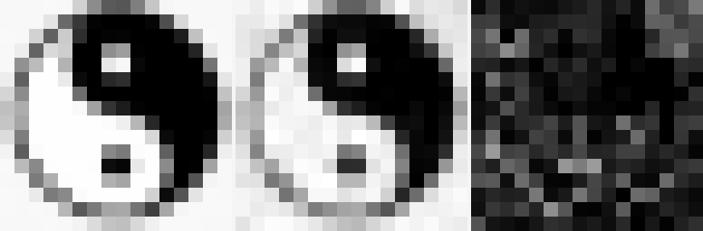
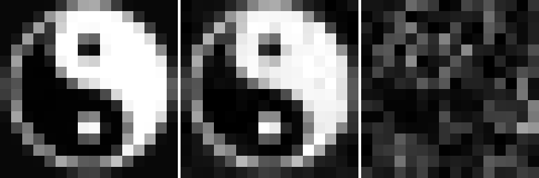
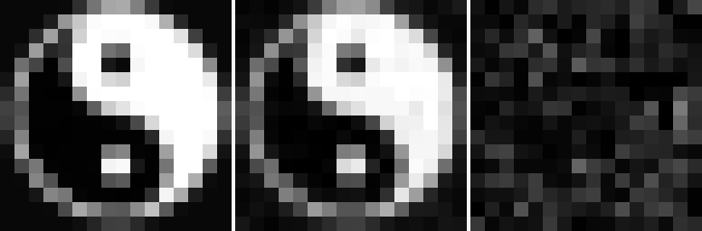
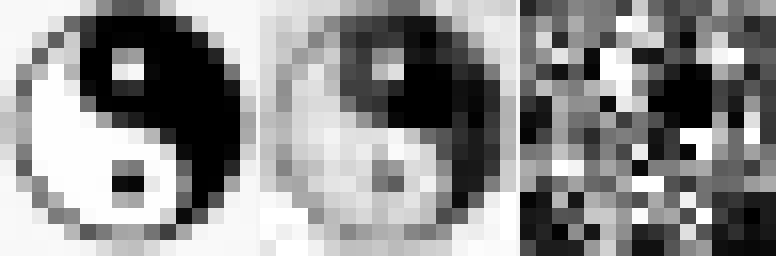
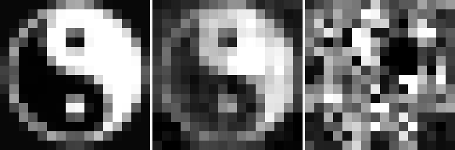
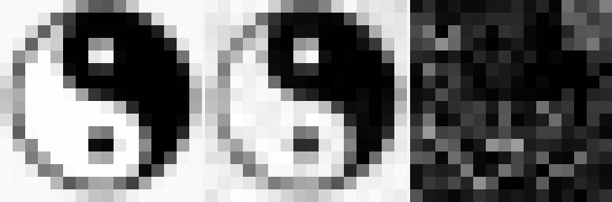
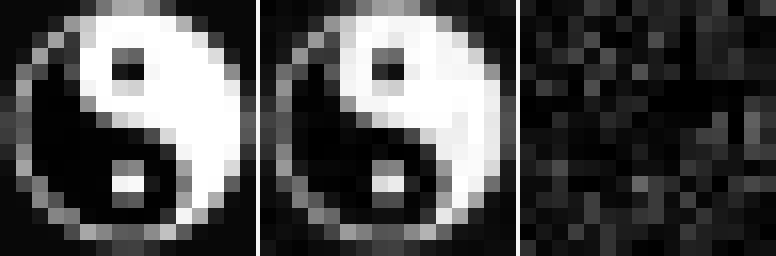
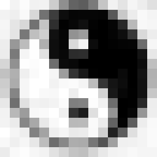
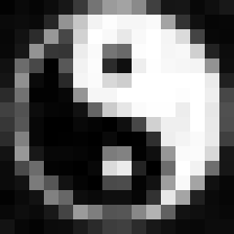

# Program AQ-STREAM-0 Run Spec

Date: 2026-06-04

## Purpose

`AQ-STREAM-0` tests whether a structured, mode-labeled stream representation can recover ordered two-frame visual state shapes better than the flat `32`-state roster used by `AQ-YINYANG-4`.

The framing is intentionally conservative:

```text
For actual quantum information, recovery still requires appropriate channel resources,
measurements, and classical side information.
```

In this simulator, the concrete question is:

```text
Can a stream of entangled-pair-like resources carry folded state-shape packets
more coherently than a flat list of patch states?
```

## Baseline

The immediate baseline is the ordered two-frame raw-state run:

```text
mode: AQ-YINYANG-4 ordered two-frame roster
patch states: 32
motif recovery: 1.0000
pixel PSNR: 25.0450 dB
luma MAE: 0.0194
noisy cosine: 0.9843
```

The one-frame controls were stronger:

```text
frame 1 raw-state PSNR: 30.0046 dB
frame 2 raw-state PSNR: 29.8073 dB
```

So the loss appears when both frames are decoded together from the larger shared roster.

## Payload

`AQ-STREAM-0` uses the successful raw-state path, not FFT coefficients.

Input frames:

```text
tpu_previews/yinyang_reference_v2/taichi_16x16_frame_1.png
tpu_previews/yinyang_reference_v2/taichi_16x16_frame_2.png
```

Each patch-time unit carries:

```text
time_bin
patch_index
frame_polarity
raw 4x4 patch state
semantic header
```

The patch target remains the same raw pixel target as `AQ-YINYANG-4`, which keeps the experiment focused on transport representation rather than coefficient/IFFT unfolding.

## Arms

`AQ-STREAM-0` runs three representation arms:

| arm | purpose |
|---|---|
| `flat_ordered_roster` | current ordered two-frame baseline representation |
| `separable_mode_stream` | tests whether explicit time/patch/polarity labels help without pair coupling |
| `entangled_pair_stream` | tests whether pair-correlation resources plus mode labels improve ordered recovery |

The arms share the same base D-LinOSS dynamics. The intended comparison is representation structure, not controller tuning.

## Simulated Pair Resource

For each `(time_bin, patch_index)` state, the stream payload builds a partner relation to the corresponding patch in the other frame.

The entangled-pair arm injects complex oscillator slots shaped like:

```text
raw_patch + i * partner_patch
pair_sum + i * pair_delta
pair_product
mode labels
```

This is a simulation resource, not a claim of physical Bell-state teleportation. The goal is to test whether pair-correlated internal modes preserve ordered visual state shape better than a flat roster.

## Metrics

Primary metrics:

- `frame_1_psnr`
- `frame_2_psnr`
- `mean_psnr`
- `temporal_order_accuracy`
- `patch_position_accuracy`
- `cross_frame_leakage`
- `frame_token_recovery`
- `polarity_recovery`

Secondary metrics:

- `image_patch_motif_recovery`
- `image_patch_luma_mae`
- `boundary_consistency`
- `pair_correlation_fidelity`
- `entanglement_resource_preservation`

The key leakage metric is:

```text
cross_frame_leakage = mean(predicted_frame != true_frame)
```

This directly tests whether frame-1 patch features are decoded into frame-2 slots, or vice versa.

## Success Criteria

Useful result:

```text
entangled_pair_stream PSNR > 25.0450 dB
cross_frame_leakage decreases
patch_position_accuracy remains 1.0000
```

Strong result:

```text
entangled_pair_stream PSNR >= 27 dB
frame_1_psnr and frame_2_psnr both move toward the one-frame controls
```

If `separable_mode_stream` matches `entangled_pair_stream`, the gain is from mode labels rather than pair correlations.

If neither stream arm improves over the flat roster, the next problem is likely decoder capacity or raw-patch numerical calibration rather than stream representation.

## Command

```powershell
$env:PROGRAM_AP_MODE='--aq-stream-0'
$env:PROGRAM_AP_EXTRA_ARGS='--out-dir /home/cityz/program_ap/program_ap_results_aq_stream0'
.\run_program_ap_ready_node.ps1
```

The ready-node launcher already uploads the explicit `taichi_*.png` reference inputs used by this run.

## Completed AQ-STREAM-0 Result

Run completed on `2026-06-04` on TRC `us-east1-d` `v6e-4` using seed `11`, noise `0.00`, depth `3`, and the two `16 x 16` tai chi frames.

| arm | mean PSNR | frame 1 PSNR | frame 2 PSNR | order | patch | leakage | pair fidelity |
| --- | ---: | ---: | ---: | ---: | ---: | ---: | ---: |
| `flat_ordered_roster` | `25.9232` | `25.7380` | `26.1167` | `1.0000` | `1.0000` | `0.0000` | `0.9937` |
| `separable_mode_stream` | `28.4754` | `28.0911` | `28.8970` | `1.0000` | `1.0000` | `0.0000` | `0.9967` |
| `entangled_pair_stream` | `17.5098` | `17.5350` | `17.4848` | `1.0000` | `1.0000` | `0.0000` | `0.9705` |

Interpretation:

- The stream machinery recovered frame identity, patch position, and polarity perfectly in all three arms.
- Explicit separable mode labels were strongly beneficial, improving the ordered two-frame baseline by about `+2.55 dB`.
- The first entangled-pair payload failed the reconstruction gate. Since ordering and leakage were perfect, the failure is not temporal confusion. It is the body encoding: `raw_patch + i * partner_patch` made the partner resource compete with local patch recovery.

Local comparison PNGs are under:

```text
tpu_previews/aq_stream0_2026-06-04/
```

Visual comparison, first entangled-pair payload:

| arm | frame 1 compare | frame 2 compare |
| --- | --- | --- |
| `flat_ordered_roster` |  |  |
| `separable_mode_stream` |  |  |
| `entangled_pair_stream` |  |  |

## Immediate Follow-Up: Pair Resource V2

The quick follow-up kept the same `--aq-stream-0` launch envelope but changed only the entangled-pair payload. The new arm preserves the local raw patch and mode labels, then adds pair information as low-gain real residual slots:

```text
entangled_pair_stream_v2 = [
  raw_patch,
  mode_features,
  0.25 * pair_delta,
  0.25 * pair_product,
  pair_corr_scalar
]
```

This tested whether pair information can help once it no longer occupies the imaginary quadrature of the source patch.

## Completed Pair Resource V2 Result

Run completed on `2026-06-04` on the same active TRC `us-east1-d` `v6e-4` TPU VM.

| arm | mean PSNR | frame 1 PSNR | frame 2 PSNR | order | patch | leakage | pair fidelity |
| --- | ---: | ---: | ---: | ---: | ---: | ---: | ---: |
| `flat_ordered_roster` | `25.9448` | `25.7323` | `26.1682` | `1.0000` | `1.0000` | `0.0000` | `0.9936` |
| `separable_mode_stream` | `28.4640` | `28.0736` | `28.8930` | `1.0000` | `1.0000` | `0.0000` | `0.9967` |
| `entangled_pair_stream` v2 | `29.2137` | `28.5450` | `30.0043` | `1.0000` | `1.0000` | `0.0000` | `0.9980` |

Interpretation:

- The v2 pair resource passed the gate and beat both the flat roster and separable mode stream.
- The original entangled arm failure was not evidence against pair resources. It was evidence against placing the partner patch directly in the source patch's imaginary quadrature.
- The useful structure appears to be: preserve the local patch body first, then add pair-state information as an auxiliary residual channel.

Local visual artifacts:

```text
tpu_previews/aq_stream0_v2_2026-06-04/
```

Visual comparison, pair-resource v2:

| arm | frame 1 compare | frame 2 compare |
| --- | --- | --- |
| `flat_ordered_roster` |  |  |
| `separable_mode_stream` |  |  |
| `entangled_pair_stream` v2 |  |  |

Direct target versus recovered panels for the successful entangled v2 arm:

| frame | target | recovered |
| --- | --- | --- |
| `1` |  |  |
| `2` |  |  |
