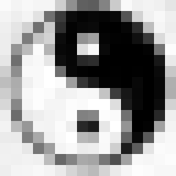
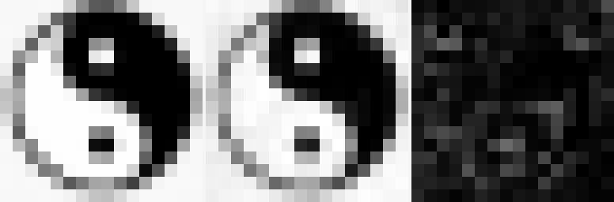

# Program AQ-YINYANG Visual Transport Findings

Date: 2026-06-03

## Purpose

The AQ-YINYANG runs tested whether D-LinOSS could transport and recover a recognizable one-frame image after semanticization into a folded k-space state.

The visual target was a small `16 x 16` grayscale tai-chi-tu frame, tiled into sixteen `4 x 4` image patches. Each patch was encoded as a direct complex FFT coefficient field and passed through the AQ/D-LinOSS folded-state recovery pipeline.

The central question was:

```text
Can one image be encoded, folded, transported, unfolded, and reconstructed?
```

The answer is now more precise:

```text
The image can be encoded losslessly in the all-coefficient semanticized k-space representation,
and D-LinOSS recovers the coefficient field strongly by cosine/identity metrics,
but the final unfolded image is still not pixel-faithful.
```

## Methodology

### Image Construction

The test image is a `16 x 16` grayscale symbolic frame. Pixel values are quantized into a small 8-bit-like grayscale alphabet, then divided into a `4 x 4` grid of `4 x 4` patches.

For each patch:

```latex
x_p \in \mathbb{R}^{4 \times 4}
```

we compute:

```latex
F_p = \mathcal{F}_2(x_p)
```

where `F_p` is the 2D FFT coefficient field for patch `p`.

The transported semantic state includes:

- semantic/header motif code,
- fixed k-space support,
- direct complex FFT coefficients,
- phase/shape diagnostics,
- checksum-like instruction features,
- L1-L5 layer features for semantic recovery.

### D-LinOSS Transport

The key correction from earlier AQ-FFT work was to encode FFT coefficients directly as complex oscillator values:

```latex
x_0[k] = F_k
```

rather than splitting coefficients into independent magnitude and phase channels:

```latex
F_k = |F_k| e^{i\phi_k}
```

This avoids the product-error problem:

```latex
\operatorname{Im}(\hat{F}_k) = |\hat{F}_k|\sin(\hat{\phi}_k)
```

where correlated magnitude and phase errors can destructively amplify imaginary-channel error.

The recovered coefficient field is reconstructed as:

```latex
\hat{x}_p =
\operatorname{Re}\left(\mathcal{F}_2^{-1}(\hat{F}_p)\right)
```

The full image is assembled by placing recovered patches back into the original `4 x 4` patch grid.

## AQ-YINYANG-1: Sparse Codec Ceiling

`AQ-YINYANG-1` used one frame but retained only ten FFT coefficients per patch:

```text
core_K = 6
residual_K = 4
total_K = 10 / 16
```

Observed:

```text
motif/source/target recovery = 1.0000
ifft_psnr                  = 15.5356 dB
oracle_psnr                = 17.0387 dB
coeff_mag_cos              = 0.9956
coeff_real_cos             = 0.9962
coeff_imag_cos             = 0.9873
topK_energy_recall         = 1.0000
energy_weighted_phase_cos  = 0.9995
```

The important result is the low oracle:

```text
oracle_psnr = 17.0387 dB
```

The oracle reconstruction is the best possible image from the retained sparse coefficient set. Since the oracle itself was poor, the sparse codec had already discarded too much high-frequency edge information before transport.

Conclusion:

```text
AQ-YINYANG-1 did not fail because D-LinOSS could not recover the semanticized field.
It failed visually because the sparse image representation could not encode the crisp binary symbol.
```

## AQ-YINYANG-2: All-Coefficient One-Image Gate

`AQ-YINYANG-2` removed the sparse codec ceiling:

```text
core_K = 16
residual_K = 0
total_K = 16 / 16
```

This retained every FFT coefficient for every `4 x 4` patch.

Observed:

```text
motif/source/target recovery = 1.0000
ifft_psnr                  = 21.4153 dB
oracle_psnr                = 80.0000 dB
coeff_mag_cos              = 0.9922
coeff_real_cos             = 0.9906
coeff_imag_cos             = 0.9847
freq_idx_overlap           = 1.0000
topK_energy_recall         = 1.0000
energy_weighted_phase_cos  = 0.9988
```

This result is decisive because:

```text
oracle_psnr = 80.0000 dB
```

means the encoded all-coefficient representation can reconstruct the original patch image essentially perfectly before transport.

However:

```text
ifft_psnr = 21.4153 dB
```

means the transported/unfolded reconstruction remains visibly imperfect after recovery.

Conclusion:

```text
AQ-YINYANG-2 proves the image can be represented losslessly in the semanticized k-space codec,
but the current D-LinOSS recovery and coefficient unfolding path does not yet reconstruct the image pixel-faithfully.
```

## AQ-YINYANG-3: Pixel-Space Decoder Check

`AQ-YINYANG-3` kept the same all-coefficient one-frame transport as `AQ-YINYANG-2`, but added a direct pixel-space ridge decoder and a simple palette prior diagnostic.

Observed:

```text
motif/source/target recovery = 1.0000
oracle_psnr                = 80.0000 dB
ifft_psnr                  = 21.4153 dB
pixel_ridge_psnr           = 21.4213 dB
palette_prior_psnr         = 20.0075 dB
dc_mae                     = 0.3472
low_freq_mae               = 0.2894
mid_freq_edge_mae          = 0.2567
coeff_mag_cos              = 0.9922
coeff_real_cos             = 0.9906
coeff_imag_cos             = 0.9847
```

This is an important negative result:

```text
pixel-space ridge decoding barely changed PSNR.
```

So the reconstruction problem is not just that the coefficient decoder was optimizing the wrong loss. The transported signature is still not numerically calibrated well enough in absolute coefficient and pixel value space.

The large `dc_mae` is especially telling. The semantic/header state and coefficient direction are both recovered strongly, but the recovered values are still off enough to shift luminance and blur local structure after inverse transform.

Conclusion:

```text
AQ-YINYANG-3 rules out a simple "just decode in pixel space" fix.
The bottleneck is deeper: local coefficient value accuracy and patchwise consistency remain insufficient for pixel-faithful reconstruction.
```

## AQ-YINYANG-4: Raw Pixel-State Reference Image Gate

`AQ-YINYANG-4` temporarily removed the FFT/folding codec from the image body and tested a simpler sanity gate:

```text
Can D-LinOSS recover the raw image patch state itself?
```

The payload used the user-provided reference PNG:

```text
tpu_previews/yinyang_reference_v2/taichi_16x16_frame_1.png
```

The frame was tiled into sixteen `4 x 4` raw pixel patch states. Those pixel vectors were injected directly into the complex oscillator slots using the same `complex_pair_norm` path that produced the best AQ-FFT/YINYANG recovery results.

Observed:

```text
motif recovery = 1.0000
pixel_psnr    = 30.0046 dB
luma_mae      = 0.0123
noisy cosine  = 0.9978
block margin  = 0.0297
topo margin   = 0.0377
```

This is a stronger visual sanity result than the earlier generated-frame test. It shows that, at the proven one-frame `16` patch-state scale, D-LinOSS can recover the raw transported image state closely enough to produce a recognizable reconstruction.

### Corrected Preview Assembly

The first PNG previews from this run were misleading. The recovery/test sampler intentionally permutes patch states:

```latex
\pi : \{0,\ldots,15\} \rightarrow \{0,\ldots,15\}
```

The preview writer originally rendered:

```text
[patch_{\pi(0)}, patch_{\pi(1)}, ..., patch_{\pi(15)}]
```

as if it were raster order:

```text
[patch_0, patch_1, ..., patch_15]
```

Therefore both the first `target.png` and `recovered.png` were spatially scrambled. The metrics were still comparing the correct paired target/recovered patch states, but the visualization did not represent the original image geometry.

The preview writer now reorders patches by `patch_true_indices` before assembling frame PNGs:

```latex
I[y,x] =
\operatorname{place}\left(p_{\pi^{-1}(k)}, \operatorname{grid}(k)\right)
```

Corrected visual artifacts:






Interpretation:

```text
The corrected target now matches the source image geometry.
The recovered image is visibly close but softened/noisy.
```

So the one-frame raw-state result should be framed as:

> D-LinOSS recovered a raw patchwise image state with perfect patch identity and strong pixel fidelity in the noise-free simulator. This validates the transport/recovery path at the smallest visual scale, but it bypasses the harder folded k-space/image-codec problem.

## Next Run: Two-Frame Folding

The immediate next run should use the same user-provided reference images, but add temporal/frame structure carefully:

```text
taichi_16x16_frame_1.png
taichi_16x16_frame_2.png
```

The first attempted two-frame run combined both frames into `32` patch states and stalled before metrics. Before moving to a different setup, the next version should reduce risk by staging the two-frame problem:

1. Recover frame 1 alone.
2. Recover frame 2 alone.
3. Fold the two frame states with an explicit frame token.
4. Decode each frame independently before testing sequential or temporal coupling.

This keeps the successful `16` patch-state recovery gate intact while introducing frame alternation as a controlled variable.

## What Worked

### Semantic Identity Recovery

Across both one-frame visual gates:

```text
source recovery = 1.0000
target recovery = 1.0000
motif/header recovery = 1.0000
```

The semantic/header state is not the bottleneck.

### Coefficient Field Recovery

The all-coefficient run recovered complex coefficient structure strongly:

```text
coeff_mag_cos  = 0.9922
coeff_real_cos = 0.9906
coeff_imag_cos = 0.9847
```

This supports the claim that D-LinOSS can preserve a high-level folded complex coefficient state in the simulator.

### Frequency Support

In AQ-YINYANG-2:

```text
freq_idx_overlap   = 1.0000
topK_energy_recall = 1.0000
```

The model was not confused about which coefficient slots existed. All slots were retained and support recovery was exact.

## The Problem We Are Encountering

The problem is no longer codec capacity and no longer semantic identity recovery.

The remaining problem is:

```text
small coefficient-space errors still unfold into visible pixel-space distortion.
```

Mathematically, inverse FFT reconstruction is sensitive to coherent phase and coefficient errors:

```latex
\hat{x} - x =
\operatorname{Re}\left(\mathcal{F}^{-1}(\hat{F} - F)\right)
```

Even when global coefficient cosines are high, structured local errors in:

- coefficient amplitude,
- quadrature orientation,
- patch-local phase,
- cross-coefficient consistency,
- patch boundary compatibility,

can produce visible image artifacts.

This explains the apparent tension:

```text
coefficient cosines are very high,
but the recovered image is still visibly degraded.
```

Cosine similarity is forgiving when the dominant coefficient energy is aligned. Pixel reconstruction is stricter: it requires the local coefficient field to be accurate in value, sign, phase, and spatial arrangement.

## Scientific Interpretation

The current defensible claim is:

> In the simulator, D-LinOSS can recover a folded semantic/image state with perfect semantic identity and strong complex coefficient fidelity. A one-frame image can be encoded losslessly in the all-coefficient k-space representation. However, the present recovery/unfolding stack does not yet achieve pixel-faithful image reconstruction after transport, even when a direct pixel-space ridge decoder is added.

This should not be described as completed image teleportation.

The more accurate framing is:

> The experiment demonstrates semanticized image-state transport with strong coefficient recovery, and identifies coefficient unfolding/pixel reconstruction as the current bottleneck.

## Why This Matters

Earlier failures could be explained by insufficient encoding capacity. AQ-YINYANG-2 removes that explanation.

The gap:

```text
oracle_psnr = 80.0000 dB
ifft_psnr   = 21.4153 dB
```

means the image was fully represented before transport, but the recovered field was not accurate enough for faithful reconstruction.

That makes the next research question sharper:

```text
How do we recover numerically accurate local coefficient and pixel values
from the folded signature, not just the right semantic/coefficient direction?
```

## Recommended Next Corrections

### 1. Direct Coefficient Error Budget

Compute reconstruction with controlled substitutions:

```text
true real + predicted imaginary
predicted real + true imaginary
true magnitude + predicted phase
predicted magnitude + true phase
true low-frequency + predicted high-frequency
predicted low-frequency + true high-frequency
```

This will identify which coefficient component causes the visible image damage.

### 2. DC / Low-Frequency Calibration

`AQ-YINYANG-3` suggests a direct calibration issue:

```text
dc_mae       = 0.3472
low_freq_mae = 0.2894
mid_freq_mae = 0.2567
```

So the next decoder pass should explicitly stabilize:

- DC coefficient scale,
- low-frequency luminance coefficients,
- edge-defining medium-frequency coefficients.

### 3. Patch Boundary Consistency Decoder

The image is reconstructed patch-by-patch. Even if each patch is locally plausible, small coefficient errors can become visible at patch boundaries.

Add a decoder term that penalizes boundary mismatch:

```latex
\mathcal{L}_{boundary}
=
\sum_{p \sim q}
\|B_p(\hat{x}_p)-B_q(\hat{x}_q)\|_2^2
```

where neighboring patch boundaries should agree.

### 4. Pixel-Space Refinement Head

Keep D-LinOSS transport in semantic/k-space, but add a small learned reconstruction head:

```text
recovered D-LinOSS signature
  -> coefficient estimate
  -> inverse FFT
  -> pixel-space correction/refinement
```

`AQ-YINYANG-3` already showed that plain linear pixel-space ridge is not enough. The next refinement head should therefore be nonlinear or structured, not just another linear readout.

### 5. Complex-Equivariant Decoder

The decoder should treat complex coefficients as coupled geometric objects, not independent scalar targets.

A better decoder should preserve:

```latex
F[-k] = \overline{F[k]}
```

and local complex-pair geometry:

```latex
|F_k|^2 = \operatorname{Re}(F_k)^2 + \operatorname{Im}(F_k)^2
```

### 6. Binary/Image-Prior Reconstruction

For this target, the source image is nearly binary. A decoder that knows the output should be close to quantized grayscale may recover sharper images from the same transported field.

This should be tested carefully as a reconstruction prior, not as evidence that transport itself improved.

## Bottom Line

AQ-YINYANG-1 showed:

```text
the sparse codec was too lossy for a crisp symbolic image.
```

AQ-YINYANG-2 showed:

```text
the all-coefficient codec can represent the image nearly perfectly,
but D-LinOSS recovery/unfolding still loses enough local coefficient detail
to prevent pixel-faithful reconstruction.
```

AQ-YINYANG-3 showed:

```text
switching to a direct pixel-space ridge decoder does not materially improve reconstruction.
```

The experiment has therefore moved from:

```text
Can we encode a one-frame image?
```

to:

```text
Can we recover local coefficient and luminance values accurately enough,
and with enough cross-patch consistency,
to reconstruct the image faithfully?
```

## AQ-YINYANG-4 Raw-State Controls

After the k-space codec experiments, `AQ-YINYANG-4` tested a simpler control: bypass the FFT/folded coefficient body and transport raw `4 x 4` pixel patches directly through D-LinOSS oscillator slots.

The reference images are user-provided `16 x 16` tai-chi-tu PNGs:

```text
tpu_previews/yinyang_reference_v2/taichi_16x16_frame_1.png
tpu_previews/yinyang_reference_v2/taichi_16x16_frame_2.png
```

Both one-frame polarity controls passed:

| input frame | motif recovery | pixel PSNR | luma MAE | noisy cosine |
|---|---:|---:|---:|---:|
| `taichi_16x16_frame_1.png` | `1.0000` | `30.0046 dB` | `0.0123` | `0.9978` |
| `taichi_16x16_frame_2.png` | `1.0000` | `29.8073 dB` | `0.0133` | `0.9963` |

This establishes an important control:

```text
The D-LinOSS recovery channel can carry the raw patchwise image state
for each polarity frame at high visual fidelity.
```

It does not yet prove folded two-frame image transport. The prior preview failure also showed that PNG comparison must preserve patch order. A randomized recovery/test order can produce correct patch identities while assembling an incorrect visual frame.

The next run was therefore ordered two-frame recovery:

```text
frames: taichi_16x16_frame_1.png + taichi_16x16_frame_2.png
states: 32 raw patch states
recovery: ordered frame/raster state order
outputs: target/recovered/error/compare PNG for each frame
```

This gate asked whether the system can recover the two-frame polarity sequence as an ordered visual object before adding explicit temporal transition operators.

## AQ-YINYANG-4 Ordered Two-Frame Recovery

The ordered two-frame raw-state run completed with both polarity frames in a single `32`-state roster and preserved frame/raster patch order in the preview writer.

Key metrics:

| run | motif recovery | pixel PSNR | luma MAE | noisy cosine | control margin |
|---|---:|---:|---:|---:|---:|
| ordered two-frame `AQ-YINYANG-4` | `1.0000` | `25.0450 dB` | `0.0194` | `0.9843` | `+0.0533` |

Local artifacts:

- `tpu_previews/yinyang_ordered2/aq_frame_depth3_noise0.0_seed11_complex_pair_norm_taichi_16x16_frame_1_target.png`
- `tpu_previews/yinyang_ordered2/aq_frame_depth3_noise0.0_seed11_complex_pair_norm_taichi_16x16_frame_1_recovered.png`
- `tpu_previews/yinyang_ordered2/aq_frame_depth3_noise0.0_seed11_complex_pair_norm_taichi_16x16_frame_1_compare.png`
- `tpu_previews/yinyang_ordered2/aq_frame_depth3_noise0.0_seed11_complex_pair_norm_taichi_16x16_frame_2_target.png`
- `tpu_previews/yinyang_ordered2/aq_frame_depth3_noise0.0_seed11_complex_pair_norm_taichi_16x16_frame_2_recovered.png`
- `tpu_previews/yinyang_ordered2/aq_frame_depth3_noise0.0_seed11_complex_pair_norm_taichi_16x16_frame_2_compare.png`

Interpretation:

```text
The ordering bug is fixed.
The recovered frames now preserve the intended polarity sequence,
and the failure mode is no longer patch scrambling.
```

What changed relative to the one-frame controls is image quality, not identity:

- one-frame frame-1 control: `30.0046 dB`
- one-frame frame-2 control: `29.8073 dB`
- ordered two-frame roster: `25.0450 dB`

That drop suggests the added burden is the larger shared recovery roster and joint two-frame state decoding, not loss of the raw transport channel itself.

Runtime note:

The first ordered two-frame run also revealed that raw `AQ-YINYANG-4` was still paying the full adversarial-control recovery cost. The code was updated so the raw image-state path marks itself as a `fast_codec_probe`, which keeps the visual artifacts while skipping unnecessary heavy control passes in future sanity runs.

So the current scientific read is:

```text
Raw patchwise semantic image transport works for one frame very strongly
and for the ordered two-frame polarity sequence meaningfully,
but reconstruction quality degrades when both frames are decoded together
from the larger shared state roster.
```
